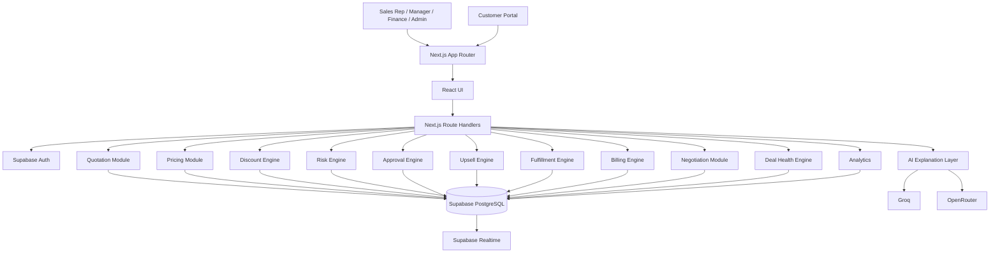
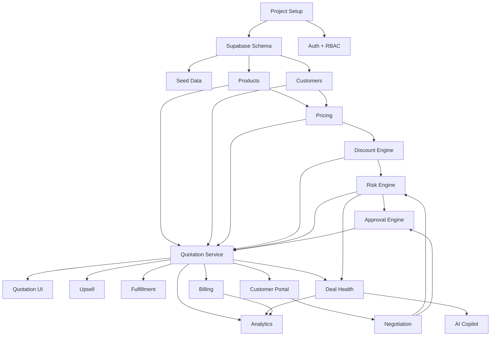

# DealFlow360 — Implementation-Ready Engineering Plan

We are now switching from **architecture mode → execution mode**.

I am keeping the approved product architecture intact. The only material change is forced by your stack constraint:

> **Next.js becomes the full-stack modular monolith. Supabase provides PostgreSQL + Auth + optional Realtime/Storage.**

We will **not** create a separate Express/Fastify backend.

That actually makes the hackathon implementation faster while preserving the architectural boundaries we designed.

The problem statement's critical requirements remain the north star: discount/approval logic, warehouse splitting, hybrid billing, customer negotiation with automatic re-approval, deal health, and a genuinely separate customer-facing view.  The technical guidelines also explicitly require those business rules to live in application logic rather than being faked for the demo. 

---

# 0. FINAL STACK

| Layer          | Technology                          | Decision                               |
| -------------- | ----------------------------------- | -------------------------------------- |
| Frontend       | **Next.js App Router + TypeScript** | Mandatory                              |
| Backend        | **Next.js Route Handlers**          | Mandatory stack + modular monolith     |
| UI             | Tailwind CSS + shadcn/ui            | Fast polished UI                       |
| Client state   | Zustand                             | Local workflow state                   |
| Server state   | TanStack Query                      | API/cache                              |
| Forms          | React Hook Form + Zod               | Validation                             |
| Database       | **Supabase PostgreSQL**             | Mandatory                              |
| DB access      | Supabase JS / server client         | Direct server-side access              |
| Authentication | **Supabase Auth**                   | Simplest fit                           |
| Authorization  | Application RBAC                    | Required                               |
| Realtime       | Supabase Realtime, selectively      | Only where useful                      |
| AI             | **Groq first**, OpenRouter fallback | Free/low-cost preference               |
| Charts         | Recharts                            | Dashboard                              |
| Testing        | Vitest + Playwright                 | Unit + E2E                             |
| Deployment     | Vercel + Supabase                   | Minimal DevOps                         |
| Dataset        | Seeded synthetic data initially     | No external dependency                 |
| Optional data  | Kaggle / Hugging Face / GitHub      | Only if useful for upsell intelligence |

### Important decision

**Do not make Kaggle/Hugging Face a runtime dependency.**

The hackathon requires working business logic, not a research pipeline. The upsell requirement can be satisfied with seeded co-purchase data and promotion rules. 

If time permits, we can enrich the historical co-purchase table using an external dataset.

---

# 1. SYSTEM ARCHITECTURE



---

# 2. CRITICAL ARCHITECTURAL RULE

The Next.js route handler is **not** where business logic lives.

Bad:

```text
route.ts
  ↓
50 lines of discount calculation
  ↓
Supabase
```

Correct:

```text
POST /api/quotes/:id/evaluate
          ↓
route.ts
          ↓
QuotationController
          ↓
QuotationEvaluationService
          ↓
DiscountEngine
          ↓
RiskEngine
          ↓
ApprovalEngine
          ↓
SupabaseRepository
```

Next.js is simply hosting the backend.

---

# 3. APPLICATION LAYERS

```text
Presentation
    ↓
API Route
    ↓
Controller
    ↓
Service
    ↓
Domain Engine
    ↓
Repository
    ↓
Supabase
```

### Dependency rule

```text
UI
 ↓
API
 ↓
Services
 ↓
Repositories
 ↓
Database
```

Never:

```text
Component → Supabase
```

for business operations.

---

# 4. IMPLEMENTATION ORDER

This is the exact build order.

```text
01. Repository + Next.js setup
02. Supabase project
03. Database schema
04. Seed data
05. Supabase Auth
06. RBAC
07. Shared types + Zod schemas
08. Customers
09. Products + pricing
10. Discount engine
11. Risk engine
12. Quotations
13. Approval engine
14. FIRST VERTICAL SLICE
15. Quotation Builder UI
16. Upsell
17. Fulfillment
18. Billing
19. Customer Portal
20. Negotiation re-approval
21. Deal Health
22. AI Copilot
23. Analytics
24. Audit polish
25. E2E testing
26. Demo reset
27. Deployment
28. Demo lock
```

**Do not change this order casually.**

---

# 5. FIRST WORKING VERTICAL SLICE

Before warehouse, billing, AI, dashboard, etc., we need this:

```text
Login
 ↓
Customers
 ↓
Create Quote
 ↓
Add Product
 ↓
Apply Discount
 ↓
Submit
 ↓
Evaluate Discount
 ↓
Risk Engine
 ↓
Approval Engine
 ↓
Supabase
 ↓
Quote status = PENDING_APPROVAL
 ↓
UI displays:
"Manager Approval Required"
```

That is our first milestone.

### Exact flow

```text
POST /api/quotes
       ↓
QuoteController.create()
       ↓
QuotationService.create()
       ↓
quoteRepository.create()
       ↓
Supabase
       ↓
QuoteResponse
       ↓
React Query
       ↓
Quote page
```

Then:

```text
POST /api/quotes/:id/submit
       ↓
QuotationService.submit()
       ↓
DiscountEngine.evaluate()
       ↓
RiskEngine.calculate()
       ↓
ApprovalEngine.determine()
       ↓
Transaction-like DB operations
       ↓
Quote status
       ↓
UI
```

---

# 6. DOMAIN OBJECTS

These are the canonical application types.

---

## 6.1 User

```ts
export type UserRole =
  | "ADMIN"
  | "SALES_REP"
  | "SALES_MANAGER"
  | "FINANCE"
  | "OPERATIONS"
  | "CUSTOMER";

export interface User {
  id: string;
  email: string;
  name: string;
  role: UserRole;
  active: boolean;
  createdAt: string;
}
```

### DB

```text
profiles
---------
id UUID PK
email TEXT UNIQUE
name TEXT
role user_role
active BOOLEAN
created_at TIMESTAMPTZ
updated_at TIMESTAMPTZ
```

### Validation

* valid email
* name 2–100 characters
* role must be known enum
* user ID comes from Supabase Auth

---

# 7. Customer

```ts
export type CustomerTier = "BRONZE" | "SILVER" | "GOLD";

export interface Customer {
  id: string;
  name: string;
  email: string;
  company: string;
  tier: CustomerTier;
  currency: string;
  active: boolean;
  createdAt: string;
}
```

### DB

```text
customers
---------
id UUID PK
company_name TEXT NOT NULL
contact_name TEXT
email TEXT
tier_id UUID FK
currency TEXT DEFAULT 'INR'
active BOOLEAN
created_at
updated_at
```

---

# 8. Product

```ts
export type ProductType =
  | "HARDWARE"
  | "SERVICE"
  | "SUBSCRIPTION";

export interface Product {
  id: string;
  name: string;
  sku: string;
  categoryId: string;
  type: ProductType;
  unit: string;
  basePrice: number;
  costPrice: number;
  taxPercent: number;
  description?: string;
  active: boolean;
}
```

### Validation

```text
price >= 0
cost >= 0
tax 0–100
SKU unique
name required
category required
```

---

# 9. Discount Rule

```ts
export interface DiscountRule {
  id: string;
  customerTierId?: string;
  categoryId?: string;
  maxDiscountPercent: number;
  priority: number;
  active: boolean;
}
```

### Rule resolution

```text
Product category rule
       +
Customer tier rule
       ↓
Most restrictive applicable ceiling
```

---

# 10. Quote

```ts
export type QuoteStatus =
  | "DRAFT"
  | "PENDING_APPROVAL"
  | "APPROVED"
  | "REJECTED"
  | "UNDER_NEGOTIATION"
  | "CONFIRMED"
  | "FULFILLING"
  | "COMPLETED"
  | "CANCELLED";

export interface Quote {
  id: string;
  quoteNumber: string;
  customerId: string;
  salesRepId: string;
  status: QuoteStatus;
  subtotal: number;
  discountAmount: number;
  total: number;
  marginAmount: number;
  marginPercent: number;
  riskScore: number;
  riskLevel: RiskLevel;
  createdAt: string;
  updatedAt: string;
}
```

---

# 11. Quote Line

```ts
export interface QuoteLine {
  id: string;
  quoteId: string;
  productId: string;
  quantity: number;
  unitPrice: number;
  discountPercent: number;
  discountAmount: number;
  lineTotal: number;
  marginAmount: number;
  billingType: "ONE_TIME" | "RECURRING";
  subscriptionPlanId?: string;
}
```

---

# 12. Risk

```ts
export type RiskLevel =
  | "LOW"
  | "MEDIUM"
  | "HIGH"
  | "CRITICAL";

export interface DealRisk {
  score: number;
  level: RiskLevel;
  reasons: RiskReason[];
}

export interface RiskReason {
  type:
    | "DISCOUNT"
    | "MARGIN"
    | "INVENTORY"
    | "STALL"
    | "NEGOTIATION"
    | "DELIVERY";

  severity: "LOW" | "MEDIUM" | "HIGH";
  message: string;
}
```

---

# 13. Approval

```ts
export type ApprovalRole =
  | "SALES_MANAGER"
  | "FINANCE";

export type ApprovalStatus =
  | "PENDING"
  | "APPROVED"
  | "REJECTED"
  | "REVISION_REQUESTED";

export interface ApprovalRequest {
  id: string;
  quoteId: string;
  step: number;
  role: ApprovalRole;
  status: ApprovalStatus;
  reviewerId?: string;
  reason?: string;
  createdAt: string;
  actedAt?: string;
}
```

---

# 14. Fulfillment

```ts
export interface FulfillmentAllocation {
  id: string;
  warehouseId: string;
  productId: string;
  quantity: number;
  shippingCost: number;
}

export interface FulfillmentPlan {
  orderId: string;
  allocations: FulfillmentAllocation[];
  shipmentCount: number;
  totalShippingCost: number;
  backorderedQuantity: number;
}
```

---

# 15. Subscription

```ts
export type BillingFrequency =
  | "MONTHLY"
  | "QUARTERLY"
  | "YEARLY";

export interface SubscriptionPlan {
  id: string;
  name: string;
  frequency: BillingFrequency;
  price: number;
  prorationEnabled: boolean;
  cancellationRefundEnabled: boolean;
}
```

---

# 16. Billing

```ts
export interface Invoice {
  id: string;
  orderId: string;
  invoiceNumber: string;
  type: "ONE_TIME" | "RECURRING";
  amount: number;
  status: "DRAFT" | "ISSUED" | "PAID" | "CANCELLED";
  dueDate: string;
}

export interface BillingSchedule {
  id: string;
  subscriptionId: string;
  billingDate: string;
  amount: number;
  status: "PENDING" | "BILLED" | "PAID";
}
```

---

# 17. Negotiation

```ts
export interface Negotiation {
  id: string;
  quoteId: string;
  customerId: string;
  status: "OPEN" | "SUBMITTED" | "ACCEPTED" | "REJECTED";
  proposedDiscount?: number;
  message?: string;
  createdAt: string;
}
```

---

# 18. Audit Log

```ts
export interface AuditLog {
  id: string;
  entityType: string;
  entityId: string;
  action: string;
  actorId: string;
  beforeData?: unknown;
  afterData?: unknown;
  reason?: string;
  createdAt: string;
}
```

This is required because the brief explicitly requires user, timestamp and reason logging for approvals, rejections and edits. 

---

# 19. DATABASE SCHEMA

Supabase tables:

```text
profiles
customer_tiers
customers

product_categories
products
price_lists
price_list_items

discount_rules
approval_rules

quotes
quote_lines

approval_requests
approval_actions

warehouses
inventory
orders
fulfillment_allocations

subscription_plans
subscriptions
billing_schedules

invoices
payments
credit_notes

negotiations
negotiation_messages

deal_health_events
alerts

upsell_rules
product_co_purchases

audit_logs
notifications
```

---

# 20. SUPABASE RLS STRATEGY

This is important.

### Internal users

Authenticated users can access appropriate internal data according to role.

### Customer

Customer can only access their own:

```text
quote
quote lines
negotiation
comments
confirmation
```

The portal must be genuinely separate/restricted, as required by the problem. 

### Service role

Never expose the Supabase service-role key to the browser.

Server-only:

```text
SUPABASE_SERVICE_ROLE_KEY
```

---

# 21. API CONVENTION

Base:

```text
/api
```

Response format:

### Success

```json
{
  "success": true,
  "data": {}
}
```

### Error

```json
{
  "success": false,
  "error": {
    "code": "DISCOUNT_LIMIT_EXCEEDED",
    "message": "Service discount exceeds the permitted ceiling.",
    "details": {}
  }
}
```

---

# 22. AUTH API

## POST `/api/auth/register`

### Request

```json
{
  "email": "rep@dealflow.demo",
  "password": "Password123!",
  "name": "Alex Sales"
}
```

### Response

```json
{
  "success": true,
  "data": {
    "user": {
      "id": "...",
      "email": "rep@dealflow.demo",
      "name": "Alex Sales",
      "role": "SALES_REP"
    }
  }
}
```

### Controller

```text
AuthController.register
```

### Service

```text
AuthService.register
```

### Repository

```text
ProfileRepository.create
```

### Errors

```text
400 INVALID_EMAIL
400 WEAK_PASSWORD
409 EMAIL_EXISTS
500 AUTH_FAILURE
```

---

## POST `/api/auth/login`

Supabase Auth handles credentials.

Application layer loads:

```text
profiles.role
```

Then returns session/user.

---

## GET `/api/auth/me`

Returns:

```json
{
  "success": true,
  "data": {
    "user": {
      "id": "...",
      "email": "...",
      "name": "...",
      "role": "SALES_REP"
    }
  }
}
```

---

# 23. CUSTOMER API

## GET `/api/customers`

Auth:

```text
ADMIN
SALES_REP
SALES_MANAGER
FINANCE
OPERATIONS
```

Query:

```text
?page=1
&limit=20
&search=acme
&tier=GOLD
```

---

## POST `/api/customers`

```json
{
  "companyName": "Acme Corp",
  "contactName": "John Doe",
  "email": "john@acme.com",
  "tier": "GOLD"
}
```

Validation:

```text
companyName required
email valid
tier enum
```

---

## GET `/api/customers/:id`

Returns customer + summary:

```json
{
  "success": true,
  "data": {
    "id": "...",
    "companyName": "Acme Corp",
    "tier": "GOLD",
    "quoteCount": 12,
    "activeQuotes": 3
  }
}
```

---

# 24. PRODUCT API

## GET `/api/products`

Filters:

```text
category
type
search
active
```

---

## POST `/api/products`

```json
{
  "name": "Laptop Pro",
  "sku": "LAP-PRO-001",
  "categoryId": "...",
  "type": "HARDWARE",
  "unit": "unit",
  "basePrice": 120000,
  "costPrice": 90000,
  "taxPercent": 18
}
```

---

## PATCH `/api/products/:id`

Update editable fields.

---

## DELETE `/api/products/:id`

Soft delete:

```text
active = false
```

---

# 25. QUOTATION API

This is the heart of the system.

---

## POST `/api/quotes`

### Request

```json
{
  "customerId": "customer-id"
}
```

### Response

```json
{
  "success": true,
  "data": {
    "quote": {
      "id": "quote-id",
      "quoteNumber": "Q-1042",
      "status": "DRAFT",
      "customerId": "customer-id",
      "subtotal": 0,
      "total": 0
    }
  }
}
```

### Controller

```text
QuotationController.create
```

### Service

```text
QuotationService.create
```

### Repository

```text
QuoteRepository.create
```

---

# 26. POST `/api/quotes/:id/lines`

### Request

```json
{
  "productId": "product-id",
  "quantity": 10,
  "discountPercent": 12,
  "subscriptionPlanId": null
}
```

### Validation

```text
quantity > 0
discount 0–100
product exists
quote is editable
```

### Service

```text
QuoteLineService.addLine
```

### DB

```text
quote_lines INSERT
```

Then server recalculates totals.

---

# 27. PATCH `/api/quotes/:id/lines/:lineId`

```json
{
  "quantity": 12,
  "discountPercent": 14
}
```

Triggers:

```text
QuoteLineService.update
 ↓
QuotationEvaluationService.evaluate
```

---

# 28. DELETE `/api/quotes/:id/lines/:lineId`

Only:

```text
DRAFT
UNDER_NEGOTIATION
```

allowed.

---

# 29. POST `/api/quotes/:id/evaluate`

This is the most important API.

### Request

```json
{
  "recalculate": true
}
```

### Controller

```text
QuotationController.evaluate
```

### Service

```text
QuotationEvaluationService.evaluate
```

### Internal flow

```text
load quote
 ↓
load lines
 ↓
load customer tier
 ↓
load discount rules
 ↓
calculate prices
 ↓
calculate line discounts
 ↓
calculate margin
 ↓
calculate blended risk
 ↓
determine approval
 ↓
return evaluation
```

### Response

```json
{
  "success": true,
  "data": {
    "subtotal": 1500000,
    "discountAmount": 120000,
    "total": 1380000,
    "marginAmount": 280000,
    "marginPercent": 20.29,
    "risk": {
      "score": 31,
      "level": "HIGH",
      "reasons": [
        {
          "type": "DISCOUNT",
          "severity": "HIGH",
          "message": "Setup Service is 8% above its permitted discount."
        }
      ]
    },
    "approval": {
      "required": true,
      "steps": [
        "SALES_MANAGER",
        "FINANCE"
      ]
    }
  }
}
```

---

# 30. POST `/api/quotes/:id/submit`

### Request

```json
{
  "reason": "Customer requested enterprise pricing"
}
```

### Backend

```text
QuotationService.submit
 ↓
evaluate
 ↓
if approval required
    create approval requests
else
    approve automatically
```

### Response

```json
{
  "success": true,
  "data": {
    "quoteId": "...",
    "status": "PENDING_APPROVAL",
    "approvalRequired": true,
    "steps": [
      "SALES_MANAGER",
      "FINANCE"
    ]
  }
}
```

---

# 31. APPROVAL API

## GET `/api/approvals`

Manager sees:

```text
PENDING
```

Finance sees:

```text
PENDING + assigned FINANCE
```

---

## GET `/api/approvals/:id`

Returns:

```json
{
  "quote": {},
  "risk": {},
  "violations": [],
  "history": []
}
```

---

## POST `/api/approvals/:id/approve`

Request:

```json
{
  "reason": "Discount justified by strategic account."
}
```

Backend:

```text
ApprovalController.approve
 ↓
ApprovalService.approve
 ↓
authorization
 ↓
validate current step
 ↓
update approval
 ↓
create audit log
 ↓
activate next step / approve quote
```

---

## POST `/api/approvals/:id/reject`

```json
{
  "reason": "Margin below acceptable threshold."
}
```

Quote becomes:

```text
REJECTED
```

---

## POST `/api/approvals/:id/revise`

```json
{
  "reason": "Reduce service discount to 12%."
}
```

Quote becomes:

```text
DRAFT
```

---

# 32. UPSELL API

## GET `/api/quotes/:id/upsell`

### Backend

```text
UpsellController.getSuggestions
 ↓
UpsellService.getSuggestions
 ↓
load quote products
 ↓
co-purchase lookup
 ↓
promotion lookup
 ↓
margin filter
 ↓
score
 ↓
sort
```

### Response

```json
{
  "success": true,
  "data": {
    "suggestions": [
      {
        "productId": "...",
        "productName": "Premium Support",
        "reason": "Frequently purchased with Laptop Pro",
        "marginDelta": 4200,
        "promotion": true
      }
    ]
  }
}
```

---

# 33. FULFILLMENT API

## GET `/api/orders/:id/fulfillment`

Returns current allocation.

---

## POST `/api/orders/:id/fulfillment/recommend`

```json
{
  "optimizeFor": "MIN_SHIPMENTS"
}
```

Response:

```json
{
  "allocations": [
    {
      "warehouseId": "main",
      "quantity": 60
    },
    {
      "warehouseId": "east",
      "quantity": 40
    }
  ],
  "shipmentCount": 2,
  "totalShippingCost": 1800,
  "backorderedQuantity": 0
}
```

---

## POST `/api/orders/:id/fulfillment/accept`

Saves recommended allocation.

---

## POST `/api/orders/:id/fulfillment/override`

```json
{
  "allocations": [
    {
      "warehouseId": "main",
      "quantity": 50
    },
    {
      "warehouseId": "east",
      "quantity": 50
    }
  ],
  "reason": "Customer requested East Depot priority."
}
```

---

# 34. SUBSCRIPTION API

## GET `/api/subscription-plans`

---

## POST `/api/subscription-plans`

```json
{
  "name": "Premium Support Monthly",
  "frequency": "MONTHLY",
  "price": 5000,
  "prorationEnabled": true,
  "cancellationRefundEnabled": true
}
```

---

# 35. BILLING API

## GET `/api/orders/:id/billing`

Returns:

```json
{
  "oneTimeInvoices": [],
  "subscriptions": [],
  "billingSchedules": []
}
```

---

## POST `/api/orders/:id/generate-billing`

Backend:

```text
Order
 ↓
Separate ONE_TIME lines
 ↓
Create invoice

RECURRING lines
 ↓
Create subscription
 ↓
Create billing schedule
```

---

## POST `/api/subscriptions/:id/modify`

```json
{
  "quantity": 4
}
```

Backend:

```text
old quantity
 ↓
new quantity
 ↓
remaining billing period
 ↓
proration
 ↓
credit/debit
 ↓
billing schedule update
```

---

# 36. NEGOTIATION API

This is the second most important flow.

## GET `/api/portal/quotes/:token`

The token identifies a restricted customer quote.

Response excludes:

```text
internal margin
internal risk
approval notes
warehouse details
internal audit logs
other customer data
```

---

## POST `/api/portal/quotes/:token/comments`

```json
{
  "quoteLineId": "...",
  "message": "Can you improve the service pricing?"
}
```

---

## POST `/api/portal/quotes/:token/counter`

```json
{
  "discountPercent": 20,
  "message": "We would proceed at 20%."
}
```

### Backend

```text
PortalController.counter
 ↓
PortalNegotiationService.counter
 ↓
verify token
 ↓
verify quote/customer
 ↓
create negotiation
 ↓
update quote
 ↓
evaluate quote
 ↓
compare new approval requirement
 ↓
if threshold exceeded
      create approval
      status = PENDING_APPROVAL
 else
      status = UNDER_NEGOTIATION
 ↓
audit
```

---

# 37. DEAL HEALTH API

## GET `/api/deal-health`

Filters:

```text
status
rep
dateFrom
dateTo
```

Response:

```json
{
  "summary": {
    "healthy": 12,
    "watch": 7,
    "atRisk": 4,
    "critical": 2
  },
  "alerts": []
}
```

---

## GET `/api/deal-health/:quoteId`

Returns:

```json
{
  "score": 74,
  "level": "AT_RISK",
  "reasons": [
    {
      "type": "STALL",
      "message": "Quote inactive for 7 days."
    },
    {
      "type": "DISCOUNT",
      "message": "Discount exceeds rep historical average."
    }
  ]
}
```

---

# 38. AI API

## POST `/api/ai/deal-explanation`

Request:

```json
{
  "quoteId": "quote-id"
}
```

The backend—not the browser—builds context.

### Context

```json
{
  "customerTier": "GOLD",
  "quoteTotal": 1380000,
  "marginPercent": 18.4,
  "riskScore": 31,
  "riskReasons": [],
  "approvalSteps": [
    "SALES_MANAGER",
    "FINANCE"
  ],
  "inventoryRisk": "MEDIUM"
}
```

### AI

```text
Groq
 ↓
if unavailable
 ↓
OpenRouter
 ↓
if unavailable
 ↓
deterministic explanation
```

### Output

```json
{
  "summary": "The deal requires additional approval.",
  "reasons": [
    "Service discount exceeds the category ceiling.",
    "The resulting margin is below the preferred target."
  ],
  "recommendation": "Reduce the service discount or obtain Finance approval."
}
```

---

# 39. AI MUST NEVER DECIDE

This:

```text
AI → approval = true
```

is forbidden.

Instead:

```text
Rules Engine
→ approval = true

AI
→ explains why
```

---

# 40. ANALYTICS API

## GET `/api/analytics/dashboard`

Query:

```text
period=week
repId=
approvalStatus=
categoryId=
```

Returns:

```json
{
  "pipelineValue": 12400000,
  "wonValue": 4800000,
  "pendingApprovals": 8,
  "atRiskDeals": 4,
  "averageDiscount": 11.4,
  "averageMargin": 23.2,
  "averageApprovalTimeHours": 7.3
}
```

The required reporting filters are period, sales team/rep, approval status, and product/category. 

---

# 41. FRONTEND ROUTES

```text
/login

/dashboard

/quotes
/quotes/new
/quotes/[id]

/approvals
/approvals/[id]

/fulfillment/[orderId]

/billing/[orderId]

/customers
/customers/[id]

/products
/products/[id]

/settings
/settings/discount-rules
/settings/warehouses
/settings/subscriptions

/deal-health

/portal/[token]
```

---

# 42. FRONTEND SCREEN: LOGIN

### Route

```text
/login
```

### Components

```text
LoginForm
EmailInput
PasswordInput
SubmitButton
AuthError
```

### Hook

```text
useLogin()
```

### Service

```text
authService.login()
```

### State

```text
email
password
loading
error
```

### API

```text
POST /api/auth/login
```

### Loading

Button:

```text
Signing in...
```

### Error

```text
Invalid credentials
```

### Empty

Not applicable.

### DoD

User successfully reaches `/dashboard`.

---

# 43. FRONTEND SCREEN: DASHBOARD

### Route

```text
/dashboard
```

### Components

```text
DashboardHeader
KpiCards
PipelineChart
DealHealthChart
ApprovalQueue
RecentQuotes
RiskAlerts
```

### Hooks

```text
useDashboardAnalytics()
useDealHealth()
usePendingApprovals()
```

### API

```text
GET /api/analytics/dashboard
GET /api/deal-health
GET /api/approvals
```

### Loading

Skeleton cards.

### Empty

```text
No active deals.
```

### Error

Individual widgets fail independently.

---

# 44. FRONTEND SCREEN: QUOTATIONS

### Route

```text
/quotes
```

### Components

```text
QuoteToolbar
QuoteFilters
QuoteTable
QuoteCard
StatusBadge
Pagination
```

### API

```text
GET /api/quotes
```

### State

```text
search
status
customer
page
```

### Loading

Table skeleton.

### Empty

```text
No quotations found.
Create your first quotation.
```

---

# 45. FRONTEND SCREEN: QUOTATION BUILDER

### Route

```text
/quotes/[id]
```

### Components

```text
QuoteHeader
CustomerSelector
ProductSearch
QuoteLineTable
QuantityControl
DiscountInput
TotalsPanel
MarginIndicator
DealGuardian
ApprovalBanner
UpsellPanel
QuoteActions
AuditTimeline
```

### Feature module

```text
features/quotation-builder/
```

### State

```text
quote
local line edits
selected customer
selected product
unsaved changes
evaluation
```

### Hooks

```text
useQuote()
useQuoteLines()
useEvaluateQuote()
useUpdateQuoteLine()
useSubmitQuote()
```

### APIs

```text
GET /api/quotes/:id
POST /api/quotes/:id/lines
PATCH /api/quotes/:id/lines/:lineId
POST /api/quotes/:id/evaluate
POST /api/quotes/:id/submit
GET /api/quotes/:id/upsell
```

### Loading

* quote skeleton
* line update spinner
* evaluation spinner

### Empty

```text
No products added.
Search products above.
```

### Error

```text
Unable to recalculate quote.
Retry
```

### DoD

A rep can create a quote, add a product, modify quantity/discount, see total + margin + risk, and submit it.

---

# 46. FRONTEND SCREEN: APPROVAL

### Route

```text
/approvals/[id]
```

### Components

```text
ApprovalHeader
QuoteSummary
RiskScore
RiskReasons
DiscountViolations
ApprovalTimeline
QuoteLines
ApprovalActions
AuditTimeline
```

### API

```text
GET /api/approvals/:id
POST /api/approvals/:id/approve
POST /api/approvals/:id/reject
POST /api/approvals/:id/revise
```

### Loading

Approval detail skeleton.

### Empty

Impossible if route is valid.

### Error

Unauthorized / no longer pending.

### DoD

Manager can approve/reject/revise and the quote transitions correctly.

---

# 47. FRONTEND SCREEN: FULFILLMENT

### Route

```text
/fulfillment/[orderId]
```

### Components

```text
InventorySummary
WarehouseAllocationTable
ShipmentSummary
BackorderBanner
AllocationComparison
AcceptSplitButton
ManualOverrideModal
```

### APIs

```text
GET /api/orders/:id/fulfillment
POST /api/orders/:id/fulfillment/recommend
POST /api/orders/:id/fulfillment/accept
POST /api/orders/:id/fulfillment/override
```

### DoD

A 100-unit order correctly becomes:

```text
Main → 60
East → 40
```

when seeded inventory requires that split.

---

# 48. FRONTEND SCREEN: BILLING

### Route

```text
/billing/[orderId]
```

### Components

```text
BillingSummary
OneTimeInvoiceCard
SubscriptionCard
BillingTimeline
ProrationPreview
InvoiceStatus
```

### APIs

```text
GET /api/orders/:id/billing
POST /api/orders/:id/generate-billing
POST /api/subscriptions/:id/modify
```

### DoD

One-time and recurring lines appear separately and produce correct schedules.

---

# 49. FRONTEND SCREEN: CUSTOMER PORTAL

### Route

```text
/portal/[token]
```

### Components

```text
PortalHeader
QuoteSummary
CustomerQuoteLines
LineComment
CounterOfferPanel
NegotiationTimeline
ConfirmQuoteButton
```

### API

```text
GET /api/portal/quotes/:token
POST /api/portal/quotes/:token/comments
POST /api/portal/quotes/:token/counter
POST /api/portal/quotes/:token/confirm
```

### Crucial rule

Never send:

```text
marginPercent
riskScore
approvalReason
internal notes
warehouse allocation
```

to the customer.

### DoD

Customer can independently view, negotiate and confirm.

---

# 50. FRONTEND SCREEN: DEAL HEALTH

### Route

```text
/deal-health
```

### Components

```text
HealthSummaryCards
HealthFilters
RiskDistribution
StalledDealsTable
DiscountAnomalyTable
DeliveryRiskTable
AlertDrawer
```

### APIs

```text
GET /api/deal-health
GET /api/deal-health/:quoteId
```

### DoD

Clicking an alert opens its quotation.

The source explicitly requires this behavior. 

---

# 51. FRONTEND SCREEN: ADMIN PRODUCTS

### Route

```text
/products
```

Components:

```text
ProductTable
ProductFilters
ProductForm
VariantEditor
PriceListPanel
```

---

# 52. FRONTEND SCREEN: DISCOUNT RULES

### Route

```text
/settings/discount-rules
```

Components:

```text
TierRulesTable
CategoryRulesTable
RuleForm
ApprovalThresholdEditor
```

Admin can configure:

```text
Bronze → 5%
Silver → 10%
Gold → 15%
```

and category restrictions.

---

# 53. FRONTEND SCREEN: WAREHOUSES

### Route

```text
/settings/warehouses
```

Components:

```text
WarehouseTable
WarehouseForm
InventoryTable
ShippingWeightEditor
```

---

# 54. FRONTEND FEATURE MODULES

Each major feature:

```text
features/
├── quotation-builder/
├── deal-guardian/
├── approvals/
├── fulfillment/
├── billing/
├── negotiation/
├── deal-health/
├── upsell/
└── deal-copilot/
```

Example:

```text
features/deal-guardian/
├── components/
│   ├── DealGuardian.tsx
│   ├── RiskScore.tsx
│   ├── RiskReasonList.tsx
│   └── ApprovalRequirement.tsx
├── hooks/
│   └── useDealEvaluation.ts
├── services/
│   └── dealGuardianApi.ts
├── types/
│   └── dealGuardian.types.ts
├── utils/
│   └── riskPresentation.ts
└── index.ts
```

---

# 55. FRONTEND FOLDER STRUCTURE

```text
src/
├── app/
│   ├── layout.tsx
│   ├── page.tsx
│   ├── globals.css
│   │
│   ├── (auth)/
│   │   └── login/
│   │       └── page.tsx
│   │
│   ├── (internal)/
│   │   ├── layout.tsx
│   │   ├── dashboard/
│   │   ├── quotes/
│   │   ├── approvals/
│   │   ├── fulfillment/
│   │   ├── billing/
│   │   ├── customers/
│   │   ├── products/
│   │   ├── settings/
│   │   └── deal-health/
│   │
│   ├── portal/
│   │   └── [token]/
│   │
│   └── api/
│       ├── auth/
│       ├── customers/
│       ├── products/
│       ├── quotes/
│       ├── approvals/
│       ├── orders/
│       ├── subscriptions/
│       ├── portal/
│       ├── deal-health/
│       ├── analytics/
│       └── ai/
│
├── components/
│   ├── ui/
│   ├── layout/
│   ├── tables/
│   ├── forms/
│   ├── charts/
│   └── feedback/
│
├── features/
│   ├── quotation-builder/
│   ├── deal-guardian/
│   ├── approvals/
│   ├── fulfillment/
│   ├── billing/
│   ├── negotiation/
│   ├── deal-health/
│   ├── upsell/
│   └── deal-copilot/
│
├── hooks/
├── lib/
│   ├── supabase/
│   ├── auth/
│   ├── api/
│   ├── validation/
│   └── utils/
│
├── services/
├── stores/
├── types/
├── schemas/
├── constants/
└── config/
```

---

# 56. BACKEND STRUCTURE INSIDE NEXT.JS

This is where I want discipline.

```text
src/server/
├── controllers/
│   ├── auth.controller.ts
│   ├── customer.controller.ts
│   ├── product.controller.ts
│   ├── quote.controller.ts
│   ├── approval.controller.ts
│   ├── fulfillment.controller.ts
│   ├── billing.controller.ts
│   ├── negotiation.controller.ts
│   ├── deal-health.controller.ts
│   ├── analytics.controller.ts
│   └── ai.controller.ts
│
├── services/
│   ├── auth.service.ts
│   ├── customer.service.ts
│   ├── product.service.ts
│   ├── quotation.service.ts
│   ├── quote-evaluation.service.ts
│   ├── approval.service.ts
│   ├── fulfillment.service.ts
│   ├── billing.service.ts
│   ├── negotiation.service.ts
│   ├── deal-health.service.ts
│   ├── analytics.service.ts
│   └── ai.service.ts
│
├── engines/
│   ├── discount.engine.ts
│   ├── risk.engine.ts
│   ├── approval.engine.ts
│   ├── fulfillment.engine.ts
│   ├── billing.engine.ts
│   └── upsell.engine.ts
│
├── repositories/
│   ├── customer.repository.ts
│   ├── product.repository.ts
│   ├── quote.repository.ts
│   ├── approval.repository.ts
│   ├── inventory.repository.ts
│   ├── billing.repository.ts
│   ├── negotiation.repository.ts
│   ├── deal-health.repository.ts
│   └── audit.repository.ts
│
├── middleware/
│   ├── require-auth.ts
│   ├── require-role.ts
│   ├── error-handler.ts
│   └── rate-limit.ts
│
├── ai/
│   ├── groq.provider.ts
│   ├── openrouter.provider.ts
│   ├── ai.schemas.ts
│   └── ai-fallback.ts
│
├── dto/
├── errors/
├── events/
└── utils/
```

---

# 57. BACKEND MODULES

| Module      | Responsibility        | Dependencies          |
| ----------- | --------------------- | --------------------- |
| Auth        | Login/session/profile | Supabase Auth         |
| Customers   | Customer CRUD         | Customer repo         |
| Products    | Product/catalog       | Product repo          |
| Pricing     | Price resolution      | Product/customer      |
| Quotations  | Quote lifecycle       | Pricing               |
| Discounts   | Discount evaluation   | Pricing/rules         |
| Risk        | Risk calculation      | Discounts/margin      |
| Approval    | Approval workflow     | Risk                  |
| Upsell      | Recommendations       | Products/co-purchases |
| Fulfillment | Warehouse allocation  | Inventory             |
| Billing     | Invoice/subscription  | Quote/order           |
| Negotiation | Customer changes      | Quote/Risk/Approval   |
| Deal Health | Risk monitoring       | Quotes/activity       |
| Analytics   | Aggregations          | All major data        |
| AI          | Explanation/copilot   | Risk/health           |

---

# 58. PUBLIC SERVICE INTERFACES

These should be treated as stable internal contracts.

```ts
interface DiscountEngine {
  evaluate(input: DiscountEvaluationInput): DiscountEvaluation;
}

interface RiskEngine {
  calculate(input: RiskInput): DealRisk;
}

interface ApprovalEngine {
  determine(risk: DealRisk): ApprovalPlan;
}

interface FulfillmentEngine {
  recommend(input: FulfillmentInput): FulfillmentPlan;
}

interface BillingEngine {
  generate(input: BillingInput): BillingResult;
}

interface UpsellEngine {
  recommend(input: UpsellInput): UpsellSuggestion[];
}
```

This makes unit testing much easier.

---

# 59. DISCOUNT ENGINE

### Input

```ts
interface DiscountEvaluationInput {
  customerTierId: string;
  lines: {
    productId: string;
    categoryId: string;
    quantity: number;
    unitPrice: number;
    discountPercent: number;
  }[];
}
```

### Algorithm

```text
for each line:

    find customer-tier rule
    find category rule

    allowed =
      min(all applicable ceilings)

    overage =
      max(0, actual - allowed)

    calculate line revenue
    calculate weighted violation

sum violations

return evaluation
```

---

# 60. RISK ENGINE

```text
discount violation
+
margin risk
+
inventory risk
+
stall risk
+
negotiation risk
```

Example:

```text
discountScore = 20
marginScore   = 5
inventory     = 3
stall         = 0

total = 28
```

Map:

```text
0–9    LOW
10–19  MEDIUM
20–34  HIGH
35+    CRITICAL
```

These values are **our implementation policy**, not values specified by the problem statement.

---

# 61. APPROVAL ENGINE

```text
IF riskScore < 10
    → no approval

IF 10 <= score < 25
    → Sales Manager

IF score >= 25
    → Sales Manager + Finance
```

Additionally:

```text
IF any hard category violation
    → minimum Manager
```

This guarantees the service-line example cannot accidentally bypass approval.

---

# 62. FULFILLMENT ENGINE

```text
Input:
requested quantities
warehouse inventory
shipping costs
```

Algorithm:

```text
1. Find warehouses containing product.
2. Sort by:
   - inventory coverage
   - shipping cost
   - consolidation preference
3. Allocate largest practical quantity.
4. Continue until fulfilled.
5. Remaining → backorder.
6. Calculate shipment count.
```

---

# 63. BILLING ENGINE

```text
for each quote line:

    if ONE_TIME:
        add to invoice

    if RECURRING:
        create subscription
        create schedule
```

Proration:

```text
dailyRate =
monthlyPrice / daysInBillingPeriod

proration =
dailyRate × remainingDays × quantityDelta
```

---

# 64. NEGOTIATION ENGINE

The most important invariant:

> **Every material customer change must cause quote re-evaluation.**

```text
Customer counter
 ↓
Persist proposal
 ↓
Apply proposed terms to evaluation context
 ↓
Run DiscountEngine
 ↓
Run RiskEngine
 ↓
Run ApprovalEngine
 ↓
Compare current approval requirements
 ↓
Create approval if required
```

Never simply set:

```text
quote.status = CONFIRMED
```

from the portal.

---

# 65. DEAL HEALTH ENGINE

Run periodically or on-demand.

Signals:

```text
days since activity
approval waiting time
discount deviation
margin deviation
inventory shortage
delivery delay
negotiation count
```

Example:

```text
stalled > 5 days
→ +20 risk

discount > rep average + 10%
→ +15

approval > 24h
→ +10

inventory shortage
→ +15
```

Again, these are configurable implementation values.

---

# 66. DATA FLOW: CREATE QUOTE

```text
User clicks New Quote
        ↓
Quote page
        ↓
useCreateQuote()
        ↓
POST /api/quotes
        ↓
Route Handler
        ↓
Auth middleware
        ↓
QuotationController
        ↓
QuotationService
        ↓
CustomerRepository
        ↓
QuoteRepository
        ↓
Supabase
        ↓
Quote DTO
        ↓
TanStack Query
        ↓
Navigate /quotes/:id
```

---

# 67. DATA FLOW: ADD PRODUCT

```text
Product search
 ↓
POST /api/quotes/:id/lines
 ↓
QuoteLineController
 ↓
QuoteLineService
 ↓
ProductRepository
 ↓
PriceResolver
 ↓
QuoteRepository
 ↓
Supabase
 ↓
Evaluation
 ↓
UI
```

---

# 68. DATA FLOW: SUBMIT QUOTE

```text
Submit
 ↓
POST /api/quotes/:id/submit
 ↓
QuotationController
 ↓
QuotationService
 ↓
DiscountEngine
 ↓
RiskEngine
 ↓
ApprovalEngine
 ↓
QuoteRepository
 ↓
ApprovalRepository
 ↓
AuditRepository
 ↓
Supabase
 ↓
Quote status
 ↓
UI
```

---

# 69. DATA FLOW: CUSTOMER NEGOTIATION

```text
Customer
 ↓
/portal/[token]
 ↓
POST /api/portal/quotes/:token/counter
 ↓
Portal Controller
 ↓
Token Authorization
 ↓
NegotiationService
 ↓
QuoteEvaluationService
 ↓
DiscountEngine
 ↓
RiskEngine
 ↓
ApprovalEngine
 ↓
ApprovalRepository
 ↓
AuditRepository
 ↓
Supabase
 ↓
Response
 ↓
Customer UI
```

---

# 70. FEATURE IMPLEMENTATION MATRIX

| Feature     | Frontend         | API                    | Controller  | Service            | Engine        | DB           | AI       |
| ----------- | ---------------- | ---------------------- | ----------- | ------------------ | ------------- | ------------ | -------- |
| Auth        | Login            | `/auth/*`              | Auth        | AuthService        | —             | profiles     | —        |
| Customers   | Customer pages   | `/customers`           | Customer    | CustomerService    | —             | customers    | —        |
| Products    | Product pages    | `/products`            | Product     | ProductService     | —             | products     | —        |
| Pricing     | Quote pricing    | internal               | —           | PricingService     | Pricing       | price lists  | —        |
| Discount    | Discount UI      | `/quotes/:id/evaluate` | Quote       | Evaluation         | Discount      | rules        | —        |
| Risk        | Deal Guardian    | evaluation             | Quote       | Evaluation         | Risk          | events       | —        |
| Approval    | Approval page    | `/approvals`           | Approval    | ApprovalService    | Approval      | approvals    | —        |
| Upsell      | Upsell panel     | `/upsell`              | Upsell      | UpsellService      | Upsell        | co-purchases | —        |
| Fulfillment | Warehouse page   | `/fulfillment`         | Fulfillment | FulfillmentService | Fulfillment   | inventory    | —        |
| Billing     | Billing page     | `/billing`             | Billing     | BillingService     | Billing       | invoices     | —        |
| Negotiation | Portal           | `/portal`              | Portal      | Negotiation        | Risk/Approval | negotiations | —        |
| Deal Health | Health dashboard | `/deal-health`         | Health      | HealthService      | Health        | events       | optional |
| Copilot     | AI panel         | `/ai/deal-explanation` | AI          | AIService          | —             | —            | Groq     |

---

# 71. TEST STRATEGY

Prioritize by **demo failure risk**, not by feature count.

## P0 tests

### Discount engine

```text
Gold + Hardware + 12%
→ valid

Gold + Service + 18%
→ violation
```

### Approval engine

```text
LOW → none
MEDIUM → manager
HIGH → manager + finance
```

### Negotiation

```text
approved quote
+
customer increases discount
=
approval restarted
```

### Fulfillment

```text
100 required
60 + 40 inventory
→ 2 warehouses
```

### Billing

```text
one-time + recurring
→ invoice + subscription
```

---

# 72. P1 TESTS

* authentication
* RBAC
* customer isolation
* quote CRUD
* upsell margin
* proration
* audit trail
* deal health
* dashboard filters

---

# 73. P2 TESTS

* AI formatting
* advanced analytics
* report export
* optional realtime
* UI snapshots

---

# 74. E2E TEST #1 — GOLDEN FLOW

```text
login
 ↓
create customer
 ↓
create quote
 ↓
add laptop
 ↓
add service
 ↓
set service discount 18%
 ↓
evaluate
 ↓
submit
 ↓
manager approval
 ↓
finance approval
 ↓
approved
 ↓
fulfillment
 ↓
billing
```

---

# 75. E2E TEST #2 — NEGOTIATION

```text
approved quote
 ↓
open portal
 ↓
counter discount
 ↓
submit
 ↓
internal approval appears
 ↓
manager opens approval
 ↓
approves
 ↓
quote continues
```

---

# 76. DEMO SAFETY

Here is where we become paranoid.

Because demos are basically software production deployments where Murphy's Law gets a microphone.

---

## Failure: AI unavailable

### Fallback

```text
AI unavailable
 ↓
Show deterministic Deal Guardian explanation
```

The demo continues.

---

## Failure: Supabase network issue

### Fallback

Seeded demo environment + retry.

But there is no honest magical fallback for the database.

Therefore:

### Before demo

```text
GET /api/health
```

Check:

```text
Database ✓
Auth ✓
AI ✓
```

---

## Failure: Wrong demo data

Create:

```bash
npm run demo:reset
```

Reset:

```text
customers
quotes
approvals
inventory
subscriptions
negotiations
audit logs
```

---

## Failure: Approval doesn't appear

Create backend integration test before demo.

Never rely on clicking around manually to "see if it works."

---

## Failure: Customer portal accidentally reveals internal data

Create explicit response DTO:

```text
CustomerQuoteDTO
```

Never return:

```text
QuoteModel
```

directly.

---

# 77. DEMO DATA

Seed:

### Customers

```text
Acme Corp       GOLD
Beta Industries SILVER
Nova Systems    BRONZE
```

### Products

```text
Laptop Pro
Enterprise Server
Setup Service
Implementation Service
Premium Support
Cloud Platform
```

### Warehouses

```text
Main Warehouse
East Depot
```

### Subscription

```text
Premium Support Monthly
₹5,000/month
```

### Rules

```text
Bronze → 5%
Silver → 10%
Gold → 15%

Hardware → 15%
Services → 10%
```

This directly mirrors the supplied problem's example. 

---

# 78. DATASET STRATEGY

Do **not** block implementation on datasets.

## MVP

Create:

```text
product_co_purchases
```

Seed:

```text
Laptop Pro → Premium Support → 72%
Laptop Pro → Dock → 61%
Server → Installation → 84%
Server → Support → 68%
```

This is enough to demonstrate recommendations.

## Optional enhancement

Later import historical purchase data from:

* Kaggle
* Hugging Face
* GitHub

into:

```text
co_purchase_events
```

Then run an offline script:

```text
raw purchases
 ↓
group transactions
 ↓
calculate product pair frequency
 ↓
populate product_co_purchases
```

Do **not** build a live ML pipeline during the hackathon unless everything else is already finished.

---

# 79. GROQ / OPENROUTER STRATEGY

Provider abstraction:

```ts
interface AIProvider {
  generateDealExplanation(
    context: DealContext
  ): Promise<DealExplanation>;
}
```

Implement:

```text
GroqProvider
OpenRouterProvider
FallbackProvider
```

Flow:

```text
Groq
 ↓
failure?
 ↓
OpenRouter
 ↓
failure?
 ↓
Deterministic explanation
```

Environment:

```env
GROQ_API_KEY=
OPENROUTER_API_KEY=
AI_PROVIDER=groq
```

Do not hardcode model names in business logic.

---

# 80. AI FILES

```text
src/server/ai/
├── ai.provider.ts
├── groq.provider.ts
├── openrouter.provider.ts
├── ai.service.ts
├── ai.schemas.ts
├── ai-prompts.ts
└── ai-fallback.ts
```

Prompt:

```text
You are a B2B sales analyst.

You are given verified structured facts about a quotation.

Do not invent facts.
Do not make approval decisions.
Explain only the provided facts.

Return JSON matching the supplied schema.
```

---

# 81. EXACT REPOSITORY STRUCTURE

```text
dealflow360/
│
├── src/
│   ├── app/
│   │   ├── (auth)/
│   │   │   └── login/
│   │   ├── (internal)/
│   │   │   ├── dashboard/
│   │   │   ├── quotes/
│   │   │   ├── approvals/
│   │   │   ├── fulfillment/
│   │   │   ├── billing/
│   │   │   ├── customers/
│   │   │   ├── products/
│   │   │   ├── settings/
│   │   │   └── deal-health/
│   │   ├── portal/
│   │   │   └── [token]/
│   │   └── api/
│   │       ├── auth/
│   │       ├── customers/
│   │       ├── products/
│   │       ├── quotes/
│   │       ├── approvals/
│   │       ├── orders/
│   │       ├── subscriptions/
│   │       ├── portal/
│   │       ├── deal-health/
│   │       ├── analytics/
│   │       └── ai/
│   │
│   ├── components/
│   │   ├── ui/
│   │   ├── layout/
│   │   ├── tables/
│   │   ├── forms/
│   │   ├── charts/
│   │   └── feedback/
│   │
│   ├── features/
│   │   ├── quotation-builder/
│   │   ├── deal-guardian/
│   │   ├── approvals/
│   │   ├── upsell/
│   │   ├── fulfillment/
│   │   ├── billing/
│   │   ├── negotiation/
│   │   ├── deal-health/
│   │   └── deal-copilot/
│   │
│   ├── server/
│   │   ├── controllers/
│   │   ├── services/
│   │   ├── engines/
│   │   ├── repositories/
│   │   ├── middleware/
│   │   ├── ai/
│   │   ├── dto/
│   │   ├── errors/
│   │   ├── events/
│   │   └── utils/
│   │
│   ├── hooks/
│   ├── lib/
│   │   ├── supabase/
│   │   │   ├── client.ts
│   │   │   ├── server.ts
│   │   │   └── admin.ts
│   │   ├── api/
│   │   ├── auth/
│   │   └── utils/
│   │
│   ├── stores/
│   ├── schemas/
│   ├── types/
│   ├── constants/
│   └── config/
│
├── supabase/
│   ├── migrations/
│   │   ├── 001_extensions.sql
│   │   ├── 002_enums.sql
│   │   ├── 003_profiles.sql
│   │   ├── 004_customers.sql
│   │   ├── 005_products.sql
│   │   ├── 006_pricing.sql
│   │   ├── 007_quotes.sql
│   │   ├── 008_approvals.sql
│   │   ├── 009_inventory.sql
│   │   ├── 010_billing.sql
│   │   ├── 011_negotiation.sql
│   │   ├── 012_health.sql
│   │   ├── 013_audit.sql
│   │   └── 014_rls.sql
│   └── seed.sql
│
├── tests/
│   ├── unit/
│   │   ├── discount-engine.test.ts
│   │   ├── risk-engine.test.ts
│   │   ├── approval-engine.test.ts
│   │   ├── fulfillment-engine.test.ts
│   │   ├── billing-engine.test.ts
│   │   └── upsell-engine.test.ts
│   │
│   ├── integration/
│   │   ├── quote-flow.test.ts
│   │   ├── approval-flow.test.ts
│   │   └── negotiation-flow.test.ts
│   │
│   └── e2e/
│       ├── golden-flow.spec.ts
│       ├── negotiation.spec.ts
│       └── customer-portal.spec.ts
│
├── scripts/
│   ├── seed-demo.ts
│   ├── reset-demo.ts
│   ├── health-check.ts
│   └── generate-co-purchases.ts
│
├── docs/
│   ├── architecture.md
│   ├── business-rules.md
│   ├── api.md
│   ├── database.md
│   └── demo-script.md
│
├── public/
├── .env.example
├── middleware.ts
├── next.config.ts
├── package.json
├── tsconfig.json
├── vitest.config.ts
├── playwright.config.ts
└── README.md
```

---

# 82. DEPENDENCY GRAPH



---

# 83. PARALLEL WORK

Assuming four people:

## Track A — Foundation + Backend Core

```text
Supabase
Schema
Auth
Products
Customers
Pricing
```

---

## Track B — Deal Engine

```text
Discount Engine
Risk Engine
Approval Engine
Quotation Service
Audit
```

This is the most important backend track.

---

## Track C — Frontend

Start immediately against mocks:

```text
App shell
Dashboard
Quotes
Quotation Builder
Deal Guardian
Approval UI
```

---

## Track D — Operations + Portal

```text
Fulfillment
Billing
Customer Portal
Negotiation
```

---

# 84. WHAT BLOCKS WHAT

### Blocker chain

```text
Database
 ↓
Models
 ↓
Repositories
 ↓
Services
 ↓
API
 ↓
Frontend integration
```

But frontend **doesn't have to wait** for backend.

Use mock objects:

```ts
mockDealEvaluation
mockQuote
mockApproval
```

This allows the UI team to move independently.

---

# 85. TICKET SYSTEM

Now the actual implementation tickets.

---

## FOUNDATION

### DF-001 — Initialize Next.js repository

**Description:** Create Next.js App Router TypeScript project with Tailwind, ESLint, path aliases and basic layouts.

**Dependencies:** None

**Files:**

```text
package.json
src/app/layout.tsx
src/app/page.tsx
tsconfig.json
```

**Acceptance:**

* `npm run dev` works
* `/` loads
* TypeScript builds
* lint passes

**Effort:** 30 min

**Owner:** Frontend

---

### DF-002 — Configure Supabase

Create:

```text
src/lib/supabase/client.ts
src/lib/supabase/server.ts
src/lib/supabase/admin.ts
```

**Acceptance:**

* browser client works
* server client works
* service-role client server-only

**Effort:** 45 min

**Owner:** Backend

---

### DF-003 — Create database migrations

Create all base tables and enums.

**Dependencies:** DF-002

**Acceptance:**

* migrations execute cleanly
* FK relationships valid
* indexes created

**Effort:** 2 hr

**Owner:** Backend

---

### DF-004 — Seed demo database

Create Acme/Beta/Nova and demo products, rules, warehouses and plans.

**Dependencies:** DF-003

**Acceptance:**

```text
npm run demo:reset
```

restores deterministic data.

**Effort:** 1 hr

**Owner:** Backend

---

# AUTH

### DF-005 — Implement Supabase login

Create login page and auth service.

**Dependencies:** DF-002

**Acceptance:**

Valid credentials enter internal app.

**Effort:** 1 hr

**Owner:** Frontend

---

### DF-006 — Implement profile + RBAC

Create:

```text
profiles
requireAuth()
requireRole()
```

**Dependencies:** DF-003, DF-005

**Acceptance:**

Unauthorized roles receive 403.

**Effort:** 1.5 hr

**Owner:** Backend

---

# CORE DATA

### DF-007 — Customer CRUD

**Dependencies:** DF-003, DF-006

**Files:**

```text
customer.repository.ts
customer.service.ts
customer.controller.ts
customers/page.tsx
```

**Acceptance:**

Create/list/view customers.

**Effort:** 1.5 hr

**Owner:** Backend + Frontend

---

### DF-008 — Product CRUD

Same structure.

**Effort:** 1.5 hr

**Owner:** Backend + Frontend

---

### DF-009 — Pricing service

Implement customer/category price resolution.

**Acceptance:**

Given customer + product, correct price is returned.

**Effort:** 1 hr

**Owner:** Backend

---

# DEAL ENGINE

### DF-010 — Discount Engine

**Dependencies:** DF-008, DF-009

Implement line-level discount ceiling.

**Acceptance:**

Gold service 18% returns 8% overage when ceiling is 10%.

**Effort:** 1.5 hr

**Owner:** Backend

---

### DF-011 — Risk Engine

**Dependencies:** DF-010

Implement weighted risk calculation.

**Acceptance:**

Multiple small violations accumulate.

**Effort:** 1.5 hr

**Owner:** Backend

---

### DF-012 — Approval Engine

**Dependencies:** DF-011

Map risk to approval chain.

**Acceptance:**

```text
low → none
medium → manager
high → manager + finance
```

**Effort:** 1 hr

**Owner:** Backend

---

### DF-013 — Audit Service

**Dependencies:** DF-003

Implement generic audit writer.

**Acceptance:**

Every approval action produces audit row.

**Effort:** 1 hr

**Owner:** Backend

---

# QUOTES

### DF-014 — Quote database/repository

**Dependencies:** DF-003

**Effort:** 1 hr

---

### DF-015 — Quote creation API

`POST /api/quotes`

**Dependencies:** DF-014, DF-007

**Effort:** 45 min

---

### DF-016 — Quote line API

Implement add/update/delete.

**Dependencies:** DF-014, DF-008

**Effort:** 1.5 hr

---

### DF-017 — Quote evaluation service

Integrate:

```text
Pricing
Discount
Risk
Approval
```

**Dependencies:** DF-009–012

**Effort:** 2 hr

---

### DF-018 — Quote submission API

**Dependencies:** DF-017, DF-013

**Effort:** 1 hr

---

# FIRST VERTICAL SLICE

### DF-019 — Complete vertical slice

Connect:

```text
Login
→ Create Quote
→ Add Product
→ Discount
→ Evaluate
→ Submit
→ Approval
```

**Dependencies:** DF-005 through DF-018

**Acceptance:**

Real browser flow works against real Supabase.

**Effort:** 2 hr

**Owner:** Backend + Frontend integration

### STOP HERE AND DEMO INTERNALLY.

If this doesn't work, nobody touches AI.

---

# QUOTATION UI

### DF-020 — Quote list

**Effort:** 1 hr

---

### DF-021 — Quote builder shell

**Effort:** 1 hr

---

### DF-022 — Product search/add

**Effort:** 1 hr

---

### DF-023 — Quote line editor

**Effort:** 1.5 hr

---

### DF-024 — Live totals/margin

**Effort:** 1 hr

---

### DF-025 — Deal Guardian UI

**Effort:** 1.5 hr

---

### DF-026 — Submit/approval banner

**Effort:** 45 min

---

# UPSELL

### DF-027 — Co-purchase schema + seed

**Effort:** 45 min

---

### DF-028 — Upsell engine

**Effort:** 1 hr

---

### DF-029 — Upsell panel UI

**Effort:** 1 hr

---

# APPROVALS

### DF-030 — Approval API

**Effort:** 1.5 hr

---

### DF-031 — Approval screen

**Effort:** 1.5 hr

---

### DF-032 — Audit timeline

**Effort:** 1 hr

---

# FULFILLMENT

### DF-033 — Warehouse/inventory schema

**Effort:** 1 hr

---

### DF-034 — Fulfillment engine

**Effort:** 2 hr

---

### DF-035 — Fulfillment API

**Effort:** 1 hr

---

### DF-036 — Fulfillment screen

**Effort:** 1.5 hr

---

# BILLING

### DF-037 — Subscription schema

**Effort:** 1 hr

---

### DF-038 — Billing engine

**Effort:** 2 hr

---

### DF-039 — Hybrid billing API

**Effort:** 1 hr

---

### DF-040 — Billing screen

**Effort:** 1.5 hr

---

# CUSTOMER PORTAL

### DF-041 — Portal token model

**Effort:** 45 min

---

### DF-042 — Restricted quote API

**Effort:** 1 hr

---

### DF-043 — Customer portal UI

**Effort:** 1.5 hr

---

### DF-044 — Line comments

**Effort:** 1 hr

---

# WOW FEATURE — NEGOTIATION SHOCKWAVE

### DF-045 — Counter-offer API

**Dependencies:** DF-017, DF-030, DF-042

**Effort:** 1.5 hr

---

### DF-046 — Re-evaluation after negotiation

**Dependencies:** DF-045

**Acceptance:**

Customer discount change can generate a new approval request.

**Effort:** 1.5 hr

---

### DF-047 — Negotiation UI

**Effort:** 1 hr

---

### DF-048 — Internal negotiation alert

**Effort:** 45 min

---

# DEAL HEALTH

### DF-049 — Deal health engine

**Effort:** 1.5 hr

---

### DF-050 — Health API

**Effort:** 45 min

---

### DF-051 — Health dashboard

**Effort:** 2 hr

---

# WOW FEATURE — DEAL COPILOT

### DF-052 — AI provider abstraction

**Effort:** 45 min

---

### DF-053 — Groq provider

**Effort:** 1 hr

---

### DF-054 — OpenRouter fallback

**Effort:** 45 min

---

### DF-055 — Structured AI response validation

**Effort:** 45 min

---

### DF-056 — Deal Copilot UI

**Effort:** 1 hr

---

# ANALYTICS

### DF-057 — Dashboard metrics API

**Effort:** 1 hr

---

### DF-058 — KPI cards

**Effort:** 45 min

---

### DF-059 — Pipeline chart

**Effort:** 1 hr

---

### DF-060 — Filters

**Effort:** 1 hr

---

# TESTING

### DF-061 — Discount unit tests

**Effort:** 45 min

---

### DF-062 — Risk unit tests

**Effort:** 45 min

---

### DF-063 — Approval unit tests

**Effort:** 45 min

---

### DF-064 — Fulfillment unit tests

**Effort:** 45 min

---

### DF-065 — Billing unit tests

**Effort:** 45 min

---

### DF-066 — Golden E2E

**Effort:** 1.5 hr

---

### DF-067 — Negotiation E2E

**Effort:** 1.5 hr

---

### DF-068 — Customer isolation E2E

**Effort:** 1 hr

---

# DEMO

### DF-069 — Demo reset script

**Effort:** 45 min

---

### DF-070 — Demo accounts

Create:

```text
sales@demo.com
manager@demo.com
finance@demo.com
customer@demo.com
```

**Effort:** 30 min

---

### DF-071 — Health check

```text
/database
/auth
/AI
```

**Effort:** 30 min

---

### DF-072 — Demo rehearsal

Run golden flow 5+ times.

**Effort:** 1 hr

---

### DF-073 — Architecture documentation

Create one-page architecture diagram and business-rule explanation.

The problem explicitly asks for an architecture diagram showing data model/module relationships. 

**Effort:** 1 hr

---

# 87. MVP CUTOFF

If time is dying, this is the exact cutoff.

## MUST WORK

```text
✓ Login
✓ RBAC
✓ Customers
✓ Products
✓ Quotes
✓ Quote lines
✓ Discounts
✓ Margin
✓ Risk
✓ Automatic approval
✓ Manager approval
✓ Customer portal
✓ Customer negotiation
✓ Re-approval
✓ Warehouse split
✓ Hybrid billing
✓ Audit trail
```

This gives us the actual required end-to-end business flow.

---

# 88. SHOULD WORK

```text
✓ Upsell
✓ Deal health
✓ Analytics
✓ Backorder
✓ Proration
```

---

# 89. WOW

```text
✓ Deal Guardian
✓ Negotiation Shockwave
✓ AI Deal Copilot
```

If necessary:

### Keep Deal Guardian + Negotiation Shockwave.

### Cut AI before either.

---

# 90. CUT ORDER

If you're behind schedule:

```text
1. Multi-currency
2. Export PDF/XLS
3. Advanced charts
4. Email notifications
5. Dataset integration
6. AI
7. WebSockets
8. Advanced anomaly detection
```

Never cut:

```text
Discount Engine
Approval Engine
Customer Portal
Negotiation reapproval
Fulfillment
Billing
```

Those are the substance.

---

# 91. DEMO SAFETY CHECKLIST

30 minutes before judging:

```text
[ ] Supabase reachable
[ ] Production environment healthy
[ ] All demo accounts work
[ ] Demo data reset
[ ] Quote exists
[ ] Inventory seeded
[ ] Discount rules seeded
[ ] Approval rules seeded
[ ] Subscription plan seeded
[ ] Customer portal token works
[ ] AI key works
[ ] AI fallback works
[ ] Golden flow tested
[ ] Negotiation flow tested
[ ] No browser console errors
[ ] No exposed secrets
```

---

# 92. DEMO MODE

I strongly recommend adding:

```text
DEMO_MODE=true
```

When enabled:

* predictable seeded data
* simplified notifications
* AI fallback available
* demo reset endpoint disabled publicly
* verbose internal logs

And:

```text
POST /api/internal/demo/reset
```

must require:

```text
ADMIN + DEMO_MODE
```

---

# 93. THE TWO DEMO FLOWS

## Flow A — Operations

```text
Login
 ↓
Create quote
 ↓
Add Laptop
 ↓
Add Setup Service
 ↓
18% discount
 ↓
Risk HIGH
 ↓
Manager + Finance
 ↓
Approve
 ↓
Warehouse split
 ↓
Hybrid billing
```

---

## Flow B — Customer Intelligence

```text
Customer portal
 ↓
View quote
 ↓
Counter 20%
 ↓
Deal Guardian recalculates
 ↓
Risk increases
 ↓
Approval automatically restarted
 ↓
Manager sees reason
 ↓
AI explains risk
 ↓
Approve
 ↓
Continue fulfillment
```

This is significantly stronger than doing two unrelated demos.

---

# 94. THE MOST IMPORTANT ENGINEERING INVARIANTS

Write these into `docs/business-rules.md`.

### Rule 1

> A quote cannot bypass approval if its calculated risk requires approval.

### Rule 2

> A customer negotiation must trigger quote re-evaluation.

### Rule 3

> Customer portal cannot access internal fields.

### Rule 4

> AI cannot make business decisions.

### Rule 5

> Historical approvals cannot be overwritten.

### Rule 6

> Fulfillment cannot allocate more inventory than exists.

### Rule 7

> Billing must distinguish one-time and recurring lines.

### Rule 8

> Every approval/rejection/edit creates an audit record.

### Rule 9

> Every quote total is calculated server-side.

### Rule 10

> The browser is never trusted for pricing or authorization.

---

# 95. DEFINITION OF "DONE"

A feature is **not done** because the screen exists.

For example, "Discounts done" means:

```text
[✓] DB rule exists
[✓] Repository works
[✓] Engine works
[✓] Unit tests pass
[✓] API works
[✓] UI can modify discount
[✓] UI receives calculated result
[✓] Unauthorized users cannot modify rule
[✓] Audit event generated
[✓] Error states implemented
[✓] Demo scenario works
```

That is our definition of done.

---

# 96. FINAL ENGINEERING EXECUTION MAP

```text
                    SUPABASE
                       │
              ┌────────┴────────┐
              │                 │
            AUTH             DATABASE
              │                 │
              └────────┬────────┘
                       │
                 NEXT.JS API
                       │
       ┌───────────────┼────────────────┐
       │               │                │
   QUOTATIONS       BUSINESS          OPERATIONS
       │             ENGINES              │
       │               │                  │
       │        ┌──────┼──────┐           │
       │        │      │      │           │
       │     DISCOUNT RISK APPROVAL    FULFILLMENT
       │                              BILLING
       │
       ├──────── UPSELL
       │
       ├──────── NEGOTIATION
       │
       └──────── DEAL HEALTH
                       │
                       ▼
                  AI COPILOT
                       │
                       ▼
                  REACT UI
```

---

# 97. THE ACTUAL BUILD PRIORITY

If I were sitting beside your team during the hackathon, this is what I'd enforce:

### First 6 hours

```text
Next.js
+
Supabase
+
schema
+
seed
+
auth
+
RBAC
+
customers
+
products
```

### Next 6 hours

```text
Pricing
+
Discount Engine
+
Risk Engine
+
Approval Engine
+
Quote API
```

### Next 4 hours

```text
Quotation Builder
+
FIRST VERTICAL SLICE
```

At this point you should already be able to demonstrate:

> **"I created a quote, violated a policy, and the system automatically routed it to the correct approver."**

That is your first victory condition.

### Next 8 hours

```text
Fulfillment
+
Billing
+
Customer Portal
+
Negotiation
```

### Next 4 hours

```text
Deal Guardian
+
Deal Health
+
Upsell
```

### Final 4–6 hours

```text
AI
+
Polish
+
Testing
+
Demo
```

---

# 98. THE ARCHITECTURAL DECISION WE SHOULD NOT CHANGE

The entire application should ultimately behave like this:

```text
                 USER ACTION
                     │
                     ▼
               ┌───────────┐
               │  QUOTE    │
               └─────┬─────┘
                     │
                     ▼
             ┌───────────────┐
             │ POLICY ENGINE │
             └───────┬───────┘
                     │
          ┌──────────┼───────────┐
          ▼          ▼           ▼
       PRICING      RISK      INVENTORY
          │          │           │
          │          ▼           │
          │       APPROVAL       │
          │          │           │
          └──────────┼───────────┘
                     ▼
                FULFILLMENT
                     │
                     ▼
                  BILLING
                     │
                     ▼
                DEAL HEALTH
                     │
                     ▼
                 MONITOR
                     │
              customer change?
                     │
                     ▼
                RE-EVALUATE
```

That loop is the soul of DealFlow360.

The source itself frames the project as a complete quotation → approval → fulfillment → billing → negotiation → reporting workflow rather than isolated screens. 

---

# 99. Final "Open the Laptop and Start" Checklist

The team should create these **first**, in this exact order:

```text
1. package.json
2. Next.js App Router
3. Tailwind/shadcn
4. Supabase project
5. .env.local
6. Supabase migrations
7. seed.sql
8. Supabase auth
9. middleware.ts
10. shared types
11. Zod schemas
12. repository layer
13. DiscountEngine
14. RiskEngine
15. ApprovalEngine
16. QuoteService
17. /api/quotes
18. Login page
19. Quote list
20. Quote builder
21. Deal Guardian
22. Approval screen
```

Then stop and run:

```text
LOGIN
  ↓
NEW QUOTE
  ↓
LAPTOP
  ↓
SETUP SERVICE
  ↓
18% DISCOUNT
  ↓
EVALUATE
  ↓
HIGH RISK
  ↓
MANAGER + FINANCE
```

**If that works against real Supabase data, DealFlow360 has officially become a real application rather than a Figma prototype.**

Everything after that is expansion around the core engine.

And that is the architecture I would lock for the hackathon: **Next.js full-stack modular monolith + Supabase PostgreSQL/Auth + deterministic business engines + isolated customer portal + optional AI explanation layer.** It satisfies the actual problem rather than merely checking off the requested screens, while keeping the implementation small enough to survive the 36-hour constraint.
