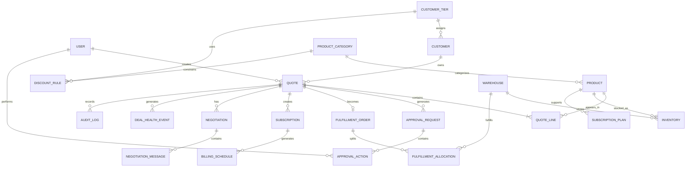
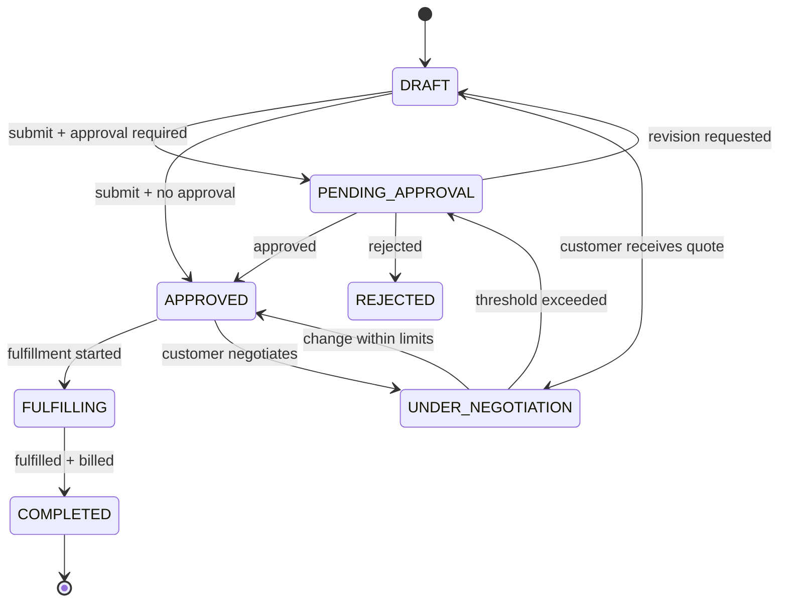
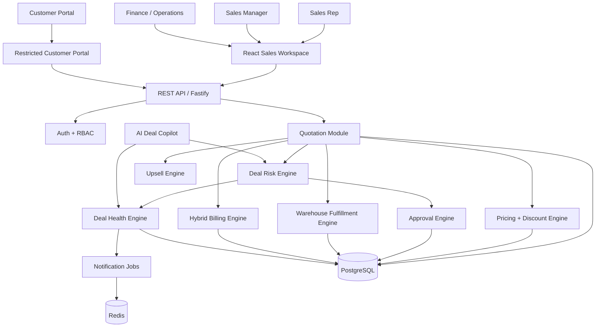

# DealFlow360 — Winner Blueprint

I went through the actual DealFlow360 problem statement page-by-page and used the hackathon blueprint you attached as the operating framework. The key constraint is important: this is **not supposed to be a pretty CRM CRUD app**. The problem explicitly evaluates the underlying business logic — discount governance, approval routing, warehouse splitting, hybrid billing, negotiation, and deal health — and says those rules must be implemented in application logic rather than faked for the demo. 

My recommendation is therefore to build **a deterministic sales-decision engine wrapped in a polished sales workspace**, with AI used only where it actually adds value.

---

# 1. Executive Verdict

## The product we should build

### **DealFlow360 — The Self-Governing Deal Engine**

> **Build the deal. DealFlow360 decides what happens next.**

The core idea:

A sales rep creates a quotation.

Instead of merely calculating a total, DealFlow360 continuously evaluates:

* Is this discount allowed?
* Who must approve it?
* Is the deal becoming risky?
* Can the order actually be fulfilled?
* Should inventory be split across warehouses?
* Does adding another product improve margin?
* Is this order one-time, recurring, or hybrid?
* Is the customer negotiating beyond permitted thresholds?
* Has the deal stalled?
* Has the customer changed terms enough to trigger re-approval?

That is the story.

The problem statement itself describes the goal as moving beyond "quote → order → invoice" toward a **self-governing deal engine** that enforces pricing discipline, reacts to inventory, reconciles recurring and one-time sales, and supports living customer negotiation. 

---

# 2. What Problem Are We Actually Solving?

## The superficial interpretation

A mediocre team reads:

> "Build a sales management system."

Then builds:

```text
Login
 ↓
Dashboard
 ↓
Products
 ↓
Customers
 ↓
Create Quote
 ↓
Approve Quote
 ↓
Invoice
```

Congratulations.

You have rebuilt a CRUD application wearing a corporate suit.

---

## The actual problem

Real B2B sales becomes messy when several systems interact simultaneously:

```text
Pricing
   +
Discount Governance
   +
Customer Tier
   +
Product Margins
   +
Approval Hierarchy
   +
Inventory
   +
Warehouses
   +
Subscriptions
   +
Customer Negotiation
   +
Deal Risk
```

The problem statement specifically calls out multi-level discounts, partial stock across warehouses, bundled subscriptions and hardware, customer negotiation, and managers discovering stalled deals too late. 

So the product isn't really:

> "A quotation application."

It is:

> **An operational decision engine that continuously determines whether a deal can safely progress.**

That distinction is our competitive advantage.

---

# 3. Users

| User          | What they care about                      |
| ------------- | ----------------------------------------- |
| Sales Rep     | Close the deal quickly                    |
| Sales Manager | Prevent bad discounts                     |
| Finance       | Protect margins / approve high-risk deals |
| Operations    | Fulfill orders correctly                  |
| Customer      | Negotiate and confirm easily              |
| Admin         | Configure business rules                  |
| Management    | See unhealthy deals early                 |

The source defines these roles explicitly, including separate responsibilities for Sales Rep, Manager/Approver, Finance/Operations, Customer Portal User, and Admin. 

---

# 4. The Core User Pain

### Sales Rep

> "I need to close the deal without waiting forever."

### Manager

> "I don't want to manually inspect every quote."

### Finance

> "I need to know when the company is giving away too much margin."

### Operations

> "Don't promise stock we don't have."

### Customer

> "I don't want to exchange 14 emails just to negotiate a quote."

### Management

> "Tell me which deals are dying before they're lost."

DealFlow360 connects all of these.

---

# 5. Why This Wins

## Winning thesis

> **Most sales systems record what happened. DealFlow360 decides what should happen next.**

That should become the entire product philosophy.

A quote isn't just a document.

It is a **state machine**.

```text
DRAFT
  ↓
RISK EVALUATION
  ↓
APPROVAL REQUIRED?
  ├── NO ──────→ FULFILLMENT
  │
  └── YES
        ↓
   MANAGER
        ↓
   FINANCE?
      ├── NO → FULFILLMENT
      └── YES
             ↓
          FINANCE
             ↓
        FULFILLMENT
             ↓
       BILLING
             ↓
        COMPLETED
```

And the customer can interrupt this process:

```text
Customer Negotiates
        ↓
Terms Changed
        ↓
Risk Recalculated
        ↓
Threshold Crossed?
   ├── No → Continue
   └── Yes → Approval Again
```

That loop is one of the strongest parts of the entire problem.

---

# 6. Product Positioning

## One-line pitch

> **DealFlow360 is an intelligent B2B sales operating system that automatically governs discounts, predicts deal risk, optimizes fulfillment, and lets customers negotiate quotes without breaking business rules.**

## 30-second pitch

> "Traditional sales software helps a rep create a quotation. DealFlow360 actively governs the deal after that. As the rep builds a quote, our engine evaluates discount risk against customer and product-level policies, automatically routes approvals, recommends margin-positive products, and checks real warehouse availability. Customers can negotiate directly inside a restricted portal, and if they push the deal beyond policy, the system automatically sends it back through approval. Once approved, the same order can contain physical products and subscriptions, with fulfillment and billing handled independently."

---

# 7. Feature Prioritization

| Feature                    | Priority | Why                         |
| -------------------------- | -------- | --------------------------- |
| Authentication + RBAC      | MUST     | Required foundation         |
| Product/catalog management | MUST     | Quote generation            |
| Customer tiers             | MUST     | Discount governance         |
| Discount rules             | MUST     | Core differentiator         |
| Approval engine            | MUST     | Core business logic         |
| Quotation builder          | MUST     | Main workflow               |
| Live margin calculation    | MUST     | Required by brief           |
| Warehouse allocation       | MUST     | Core operational logic      |
| Hybrid billing             | MUST     | Core requirement            |
| Customer portal            | MUST     | Explicit requirement        |
| Negotiation → reapproval   | MUST     | Excellent demo moment       |
| Deal health dashboard      | SHOULD   | Management visibility       |
| Audit trail                | SHOULD   | Technical credibility       |
| Upsell/cross-sell          | SHOULD   | Required business outcome   |
| Automated alerts           | SHOULD   | Makes product feel alive    |
| AI deal copilot            | WOW      | Differentiation             |
| Predictive deal risk       | WOW      | Memorable if done correctly |
| Multi-currency             | NICE     | Explicitly bonus only       |
| Multi-company              | CUT      | Not worth hackathon risk    |
| Full accounting system     | CUT      | Scope explosion             |
| Real payment gateway       | CUT      | Not necessary for winning   |
| Microservices              | CUT      | Architecture theatre        |

The source explicitly identifies multi-currency and multi-company as bonuses rather than requirements. 

---

# 8. The Two WOW Features

I would build exactly these two.

---

## WOW #1 — Deal Guardian

### Concept

A persistent intelligence layer watching the quotation.

As the rep changes:

* quantity
* discount
* products
* customer
* subscription
* terms

Deal Guardian recalculates:

```text
DEAL HEALTH
━━━━━━━━━━━━━━━━━━
Discount Risk       LOW
Margin              24.7%
Approval            Manager
Inventory           92%
Delivery Risk       LOW
Negotiation         Stable
━━━━━━━━━━━━━━━━━━
Overall Deal Score  81/100
```

If something changes:

```text
⚠ DEAL RISK INCREASED

Service discount changed:
10% → 18%

Allowed: 10%
Exceeded: +8 points

Required approval:
Sales Manager → Finance
```

### Why judges care

Because the system isn't merely displaying database records.

It is **reacting to user actions in real time**.

---

# 9. WOW #2 — Negotiation Shockwave

This is the demo killer.

The customer opens the quote.

They change:

```text
Discount:
12% → 20%
```

Immediately:

```text
Customer Request
       ↓
Quote recalculated
       ↓
Margin drops
       ↓
Risk score rises
       ↓
Approval threshold crossed
       ↓
Manager approval required
       ↓
Finance required
```

The customer sees:

> "Your requested changes have been submitted for review."

The internal manager dashboard simultaneously changes:

```text
NEW APPROVAL REQUIRED

Acme Corp
Quote #Q-1042

Reason:
Customer counter-offer exceeded
Service discount ceiling.

Risk: HIGH
Margin impact: -6.8%
```

That gives you the "holy shit, the systems are connected" moment.

The source explicitly requires that if negotiated final terms exceed thresholds, the quotation automatically re-enters approval. 

---

# 10. What Should NOT Be AI

This is extremely important.

Do **not** use an LLM for:

* discount calculations
* approval decisions
* stock allocation
* billing calculations
* proration
* permissions
* invoice totals
* risk threshold enforcement

Those need deterministic logic.

Otherwise a judge can ask:

> "Why did the AI decide this discount requires Finance?"

And you have just voluntarily walked into a swamp.

---

# 11. Where AI Actually Belongs

AI should sit **on top of the deterministic engine**.

Possible AI feature:

## Deal Copilot

The rep can ask:

> "Why is this deal considered risky?"

AI receives verified structured facts:

```json
{
  "customerTier": "Gold",
  "discount": 18,
  "allowedDiscount": 15,
  "margin": 11.2,
  "approvalRequired": ["MANAGER", "FINANCE"],
  "warehouseShortage": 24,
  "dealAgeDays": 9
}
```

AI responds:

> "The deal is high risk primarily because the service line is 8 percentage points above its permitted discount and available stock requires fulfillment from two warehouses. Finance approval is therefore required."

The AI **explains the engine**.

It does not replace it.

---

# 12. Important Source-Specified Discount Logic

The problem statement gives a particularly important example.

A Gold customer might normally receive up to 15%.

But:

```text
Hardware → 15%
Services → 10%
```

A quote containing:

```text
Laptop
12% discount
Allowed 15%
→ OK

Setup Service
18% discount
Allowed 10%
→ +8 points violation
```

The entire quotation becomes approval-required even though Gold customers normally get 15%. 

The brief also says multiple smaller violations can accumulate into a blended risk rather than evaluating only the worst line. 

### Important architectural point

The exact mathematical formula for that blended score is **not specified by the problem statement**.

Therefore we should implement our own transparent formula and document it.

For example:

```text
line_overage =
    max(0, actual_discount - allowed_discount)

weighted_violation =
    line_overage × line_revenue / total_revenue

blended_score =
    Σ(weighted_violation)
```

Then layer thresholds:

```text
0–5       → No approval
5–15      → Sales Manager
15–25     → Manager + Finance
>25       → High Risk
```

These threshold values are **our implementation choice**, not requirements from the PDF.

That distinction is something you should explicitly mention to judges.

---

# 13. Winning Architecture

## Architecture philosophy

**Modular monolith.**

Not:

```text
Auth Microservice
Quote Microservice
Pricing Microservice
AI Microservice
Warehouse Microservice
Billing Microservice
Notification Microservice
...
```

That would be hilarious for a 36-hour hackathon, right up until deployment murders everyone.

Instead:

```text
                 ┌─────────────────────┐
                 │      Web Client      │
                 │ React + TypeScript   │
                 └──────────┬──────────┘
                            │
                            ▼
                 ┌─────────────────────┐
                 │     API Layer       │
                 │ REST / JSON         │
                 └──────────┬──────────┘
                            │
                            ▼
        ┌────────────────────────────────────────┐
        │          MODULAR BACKEND               │
        │                                        │
        │ Auth / RBAC                            │
        │ Customers                              │
        │ Products / Pricing                     │
        │ Quotations                             │
        │ Discount Engine                        │
        │ Approval Engine                        │
        │ Warehouse Engine                       │
        │ Billing Engine                         │
        │ Negotiation                            │
        │ Deal Health                            │
        │ Notifications                          │
        │ Analytics                              │
        └───────────────┬────────────────────────┘
                        │
                        ▼
               ┌─────────────────┐
               │   PostgreSQL    │
               └─────────────────┘
                        │
              ┌─────────┴──────────┐
              ▼                    ▼
       Background Jobs          AI Layer
       Notifications            Deal Copilot
       Health checks            Explanation
              │
              ▼
        External Services
```

---

# 14. Recommended Technology Stack

| Layer      | Choice                         | Reason                                   |
| ---------- | ------------------------------ | ---------------------------------------- |
| Frontend   | React + TypeScript + Vite      | Fast development, excellent UI ecosystem |
| UI         | Tailwind CSS + shadcn/ui       | Fast polished enterprise UI              |
| State      | Zustand + TanStack Query       | Simple client state + server caching     |
| Forms      | React Hook Form + Zod          | Fast robust forms                        |
| Backend    | Node.js + TypeScript           | Same language across stack               |
| API        | Fastify                        | Lightweight and fast                     |
| ORM        | Prisma                         | Excellent TypeScript productivity        |
| Database   | PostgreSQL                     | Relational workflow/data                 |
| Auth       | JWT + HTTP-only refresh cookie | Straightforward RBAC                     |
| Validation | Zod                            | Shared schema validation                 |
| Jobs       | BullMQ + Redis                 | Async notifications/recalculations       |
| AI         | OpenAI API                     | Explanation/copilot only                 |
| Charts     | Recharts                       | Fast dashboard implementation            |
| Deployment | Vercel + Render/Railway        | Minimal DevOps overhead                  |
| Storage    | S3-compatible storage          | Only if documents become necessary       |
| Monitoring | Structured logs + Sentry       | Enough for hackathon                     |
| API docs   | OpenAPI/Swagger                | Judge-friendly technical credibility     |

---

# 15. Why PostgreSQL?

This domain is relational as hell.

You have:

```text
Customer
 ↓
Quotation
 ↓
Quotation Lines
 ↓
Products
 ↓
Discount Rules
 ↓
Approval
 ↓
Order
 ↓
Warehouse Allocations
 ↓
Invoices
 ↓
Subscription
```

SQL is the natural fit.

NoSQL would create more work for no judging benefit.

---

# 16. Why Modular Monolith?

Because the business logic needs transactions.

Imagine:

```text
Customer negotiation
        ↓
Change quote
        ↓
Recalculate risk
        ↓
Create approval
        ↓
Update quote status
        ↓
Write audit event
```

These should happen transactionally.

A modular monolith lets us do:

```text
POST /quotes/:id/negotiate
          ↓
NegotiationService
          ↓
RiskEngine
          ↓
ApprovalEngine
          ↓
QuoteRepository
          ↓
AuditRepository
```

without distributed-system nonsense.

---

# 17. Backend Module Architecture

```text
backend/
├── src/
│   ├── app.ts
│   ├── server.ts
│   │
│   ├── config/
│   │   ├── env.ts
│   │   └── constants.ts
│   │
│   ├── modules/
│   │   ├── auth/
│   │   ├── users/
│   │   ├── customers/
│   │   ├── products/
│   │   ├── pricing/
│   │   ├── quotations/
│   │   ├── discounts/
│   │   ├── approvals/
│   │   ├── fulfillment/
│   │   ├── subscriptions/
│   │   ├── billing/
│   │   ├── negotiation/
│   │   ├── deal-health/
│   │   ├── analytics/
│   │   └── notifications/
│   │
│   ├── infrastructure/
│   │   ├── database/
│   │   ├── redis/
│   │   ├── ai/
│   │   └── storage/
│   │
│   ├── middleware/
│   │   ├── auth.ts
│   │   ├── roles.ts
│   │   ├── error-handler.ts
│   │   └── rate-limit.ts
│   │
│   ├── jobs/
│   │   ├── deal-health.job.ts
│   │   ├── notification.job.ts
│   │   └── billing.job.ts
│   │
│   └── shared/
│       ├── errors/
│       ├── types/
│       ├── utils/
│       └── events/
│
├── prisma/
│   ├── schema.prisma
│   └── seed.ts
│
└── tests/
```

---

# 18. Where Business Logic Lives

This matters enormously.

### Controller

Only handles HTTP.

```text
Request
 ↓
Validation
 ↓
Service
 ↓
Response
```

### Service

Business orchestration.

```text
QuotationService
DiscountEngine
ApprovalEngine
FulfillmentEngine
BillingEngine
```

### Repository

Database interaction.

```text
quoteRepository.findById()
quoteRepository.update()
```

Never:

```text
Controller → Prisma → calculate discount → send email
```

That becomes unmaintainable within approximately 14 minutes.

---

# 19. Frontend Architecture

```text
frontend/
├── src/
│   ├── app/
│   │   ├── router.tsx
│   │   ├── providers.tsx
│   │   └── layouts/
│   │
│   ├── pages/
│   │   ├── auth/
│   │   ├── dashboard/
│   │   ├── quotations/
│   │   ├── approvals/
│   │   ├── fulfillment/
│   │   ├── billing/
│   │   ├── customers/
│   │   ├── products/
│   │   ├── settings/
│   │   └── portal/
│   │
│   ├── features/
│   │   ├── quotation-builder/
│   │   ├── approval/
│   │   ├── fulfillment/
│   │   ├── negotiation/
│   │   ├── deal-health/
│   │   ├── subscriptions/
│   │   └── deal-copilot/
│   │
│   ├── components/
│   │   ├── ui/
│   │   ├── charts/
│   │   ├── tables/
│   │   ├── forms/
│   │   └── feedback/
│   │
│   ├── services/
│   │   ├── api-client.ts
│   │   ├── quote-api.ts
│   │   ├── approval-api.ts
│   │   └── ...
│   │
│   ├── store/
│   │   ├── auth.store.ts
│   │   └── quote.store.ts
│   │
│   ├── hooks/
│   ├── types/
│   ├── schemas/
│   ├── utils/
│   └── constants/
│
└── ...
```

---

# 20. Major Screens

The problem statement explicitly calls for quotation/pipeline, quotation builder, approval, upsell, warehouse split, subscription billing, customer negotiation, and deal-health views. 

I would turn those into this product structure:

```text
Dashboard
│
├── Sales Workspace
│   ├── Quotations
│   ├── Pipeline
│   └── Quotation Builder
│
├── Operations
│   ├── Approvals
│   ├── Fulfillment
│   └── Billing
│
├── Intelligence
│   ├── Deal Health
│   └── Deal Copilot
│
├── Customers
│
└── Configuration
    ├── Products
    ├── Price Lists
    ├── Discount Rules
    ├── Warehouses
    └── Subscription Plans
```

---

# 21. The Quotation Builder — Most Important Screen

This should be the hero screen.

### Layout

```text
┌─────────────────────────────────────────────────────────────┐
│ DealFlow360    Quote #Q-1042       Draft       [Save]       │
├─────────────────────────────────────────────────────────────┤
│ Customer: Acme Corp        Tier: GOLD                       │
├───────────────────────────────┬─────────────────────────────┤
│ PRODUCTS                      │ DEAL GUARDIAN               │
│                               │                             │
│ Laptop × 10                   │ Risk       ███████░ 72     │
│ $12,000                       │                             │
│                               │ Margin     18.4%            │
│ Setup Service × 1             │                             │
│ $3,000                        │ Discount   18%              │
│                               │ Allowed    15%              │
│ Subscription × 1              │                             │
│ $500 / month                  │ Approval   Manager + Finance│
│                               │                             │
│ [+ Add Product]               │ ⚠ Service discount high    │
│                               │                             │
├───────────────────────────────┴─────────────────────────────┤
│ UPSELL & CROSS-SELL                                          │
│                                                             │
│ Deployment Kit      +$850 margin       [Add]                │
│ Premium Support     +$420 margin       [Add]                │
├─────────────────────────────────────────────────────────────┤
│ Total: $15,500             Margin: 18.4%                    │
│                                                             │
│ [Save Draft]                  [Submit for Approval →]       │
└─────────────────────────────────────────────────────────────┘
```

This directly surfaces the problem's requirement that the quotation builder show products, discounts, totals and live margin, while the upsell panel shows suggested products and margin delta. 

---

# 22. Deal Guardian Data Flow

```text
Rep changes discount
        ↓
Frontend local state
        ↓
Debounced API request
        ↓
QuoteEvaluationService
        ↓
PricingService
        ↓
DiscountRuleEngine
        ↓
MarginCalculator
        ↓
RiskEngine
        ↓
ApprovalEngine
        ↓
Evaluation Result
        ↓
Frontend
        ↓
Risk UI updates
```

---

# 23. API Contract

## Authentication

| Method | Endpoint             | Purpose         |
| ------ | -------------------- | --------------- |
| POST   | `/api/auth/register` | Register        |
| POST   | `/api/auth/login`    | Login           |
| POST   | `/api/auth/logout`   | Logout          |
| GET    | `/api/auth/me`       | Current user    |
| POST   | `/api/auth/refresh`  | Refresh session |

---

## Quotations

| Method | Endpoint                   | Purpose       |
| ------ | -------------------------- | ------------- |
| GET    | `/api/quotes`              | List quotes   |
| POST   | `/api/quotes`              | Create quote  |
| GET    | `/api/quotes/:id`          | Get quote     |
| PATCH  | `/api/quotes/:id`          | Update quote  |
| POST   | `/api/quotes/:id/evaluate` | Evaluate deal |
| POST   | `/api/quotes/:id/submit`   | Submit quote  |
| POST   | `/api/quotes/:id/confirm`  | Confirm quote |

---

## Quote Lines

```text
POST /api/quotes/:id/lines
PATCH /api/quotes/:id/lines/:lineId
DELETE /api/quotes/:id/lines/:lineId
```

---

## Approval

```text
GET  /api/approvals
GET  /api/approvals/:id
POST /api/approvals/:id/approve
POST /api/approvals/:id/reject
POST /api/approvals/:id/revise
```

---

## Fulfillment

```text
GET  /api/orders/:id/fulfillment
POST /api/orders/:id/fulfillment/accept
POST /api/orders/:id/fulfillment/override
POST /api/orders/:id/fulfillment/consolidate
```

---

## Negotiation

```text
GET  /api/portal/quotes/:token
POST /api/portal/quotes/:token/comments
POST /api/portal/quotes/:token/counter
POST /api/portal/quotes/:token/confirm
```

Notice the portal uses a restricted tokenized resource rather than internal quote APIs.

That directly supports the requirement that the customer view be genuinely separate and restricted. 

---

# 24. Discount Evaluation API

```http
POST /api/quotes/:id/evaluate
```

### Request

```json
{
  "lines": [
    {
      "productId": "prod_laptop",
      "quantity": 10,
      "discountPercent": 12
    },
    {
      "productId": "prod_setup",
      "quantity": 1,
      "discountPercent": 18
    }
  ]
}
```

### Response

```json
{
  "quoteId": "Q-1042",
  "subtotal": 18000,
  "discountAmount": 2400,
  "total": 15600,
  "marginPercent": 18.4,
  "risk": {
    "score": 31,
    "level": "HIGH"
  },
  "approval": {
    "required": true,
    "steps": [
      "SALES_MANAGER",
      "FINANCE"
    ]
  },
  "violations": [
    {
      "lineId": "line_setup",
      "actual": 18,
      "allowed": 10,
      "overage": 8
    }
  ]
}
```

---

# 25. Database Architecture

Core schema:

```text
users
roles
customers
customer_tiers

products
product_categories
product_variants
price_lists
price_list_items

discount_rules
approval_rules

quotes
quote_lines

approval_requests
approval_actions

warehouses
inventory
fulfillment_orders
fulfillment_allocations

subscription_plans
subscriptions
billing_schedules
invoices
payments
credit_notes

negotiations
negotiation_messages

deal_health_events
alerts

audit_logs
notifications
```

---

# 26. ER Diagram



---

# 27. Critical Database Constraints

### Quote

```text
status:
DRAFT
PENDING_APPROVAL
APPROVED
REJECTED
UNDER_NEGOTIATION
CONFIRMED
FULFILLING
COMPLETED
CANCELLED
```

### Approval

```text
PENDING
APPROVED
REJECTED
REVISION_REQUESTED
```

### Subscription

```text
ACTIVE
PAUSED
CANCELLED
```

### Fulfillment

```text
PENDING
PARTIAL
FULFILLED
BACKORDERED
```

These state enums prevent the system from becoming a collection of contradictory booleans.

---

# 28. Important Indexes

```text
quotes(customer_id)
quotes(status)
quotes(created_at)
quotes(sales_rep_id)

quote_lines(quote_id)
quote_lines(product_id)

approval_requests(quote_id)
approval_requests(status)

inventory(product_id, warehouse_id)

deal_health_events(quote_id, created_at)

audit_logs(entity_type, entity_id, created_at)
```

---

# 29. Complete Primary Data Flow

```text
USER
 ↓
React UI
 ↓
API Client
 ↓
Fastify Route
 ↓
Zod Validation
 ↓
Authentication
 ↓
Authorization
 ↓
Quotation Controller
 ↓
Quotation Service
 ↓
┌─────────────────────────────┐
│ Pricing Engine              │
│ Discount Engine             │
│ Margin Engine               │
│ Risk Engine                 │
│ Approval Engine             │
└─────────────────────────────┘
 ↓
PostgreSQL Transaction
 ↓
Audit Event
 ↓
Response DTO
 ↓
TanStack Query
 ↓
React State
 ↓
UI
```

---

# 30. Quotation State Machine



---

# 31. Approval Logic

```text
IF quote submitted
    ↓
Calculate each line's allowed discount
    ↓
Calculate line violations
    ↓
Calculate blended risk score
    ↓
IF score <= safe threshold
    → APPROVED

ELSE IF score <= finance threshold
    → SALES_MANAGER approval

ELSE
    → SALES_MANAGER
    → FINANCE
```

But there is another important rule:

```text
IF quote is already approved
AND customer changes terms
    ↓
Recalculate entire quote
    ↓
IF new risk > previous approved risk
    ↓
Create new approval request
```

Never simply mutate the existing approval.

Create a new approval event.

---

# 32. Audit Trail

Every important action should generate:

```json
{
  "entity": "QUOTE",
  "entityId": "Q-1042",
  "action": "DISCOUNT_CHANGED",
  "actorId": "user_23",
  "before": {
    "discount": 12
  },
  "after": {
    "discount": 18
  },
  "reason": "Customer negotiation",
  "timestamp": "..."
}
```

The source explicitly requires approvals, rejections and edits to be logged with user, timestamp and reason. 

This is low effort and gives enormous technical credibility.

---

# 33. Warehouse Fulfillment Engine

Suppose:

```text
Order:
100 × Laptop
```

Inventory:

```text
Main Warehouse
60

East Depot
50
```

Engine calculates:

```text
Main → 60
East → 40
```

Then:

```text
Shipment count = 2
Shipment cost = calculated
```

The problem explicitly requires warehouse splitting based on live stock, with manual override and backorder consolidation. 

---

# 34. Optimization Logic

We should not build a fancy optimization solver.

Use a deterministic heuristic:

```text
1. Find warehouses with available stock.
2. Prefer warehouses with enough inventory to fulfill largest portion.
3. Penalize additional shipments.
4. Consider shipping cost.
5. Allocate until requested quantity is fulfilled.
6. Remaining quantity → backorder.
```

Objective:

```text
Minimize:

shipment_count × shipment_weight
+
shipping_cost
+
backorder_penalty
```

Again: simple, explainable, demoable.

---

# 35. Hybrid Billing

One order:

```text
MacBook
₹100,000
ONE_TIME

Support Subscription
₹5,000/month
RECURRING
```

System produces:

```text
Order
├── One-time invoice
│      ₹100,000
│
└── Subscription
       ₹5,000/month
       Next billing: ...
```

The source explicitly requires one-time and recurring lines to coexist within a single order with separate billing schedules and proration. 

---

# 36. Proration

For a monthly subscription:

```text
Monthly price = ₹5,000
Days in month = 30
Used = 10 days
Remaining = 20 days
```

Remaining value:

```text
₹5,000 × 20/30
= ₹3,333.33
```

If quantity changes from:

```text
2 → 4
```

the system calculates the incremental amount only for the remaining billing period.

This should be a deterministic BillingService.

Absolutely no AI.

---

# 37. Upsell Engine

The problem asks for suggestions based on co-purchase history, promotions and minimum margin thresholds. 

Start simple.

```text
suggestion_score =
    co_purchase_score
    + promotion_bonus
    + margin_bonus
```

Filter:

```text
IF product.margin < minimum_margin
    → don't recommend
```

Return:

```json
{
  "product": "Premium Support",
  "reason": "Frequently purchased with Laptop Pro",
  "marginDelta": 420,
  "promotion": true
}
```

The frontend then says:

> "Customers buying this product often add Premium Support."

Much more convincing than:

> "AI recommends Premium Support."

---

# 38. Deal Health Engine

Deal Health should combine deterministic signals.

Example:

```text
Age score
+
Discount anomaly
+
Approval delay
+
Inventory risk
+
Delivery slippage
+
Negotiation frequency
```

Output:

```text
Healthy
Watch
At Risk
Critical
```

The source specifically asks the dashboard to identify stalled deals, discount anomalies and delivery promise slippage. 

---

# 39. Deal Health Example

```text
ACME CORP

Deal Health: AT RISK

Reasons:

⚠ Quote inactive for 7 days
⚠ Discount 34% above rep average
⚠ Approval pending for 27 hours
⚠ 20 units require second warehouse

Recommended action:

Escalate to Sales Manager
```

That "Reasons" section is important.

Don't make a mysterious red score.

Make it explainable.

---

# 40. AI Architecture

```text
User asks:
"Why is this deal risky?"
        ↓
Backend gathers verified deal facts
        ↓
Context builder
        ↓
Structured prompt
        ↓
LLM
        ↓
Structured response
        ↓
Schema validation
        ↓
Fact consistency check
        ↓
UI
```

### AI must never receive arbitrary authority.

It should receive:

```text
Quote facts
Customer facts
Approval facts
Inventory facts
Deal-health facts
```

Not:

```text
"Here is the whole database, figure it out."
```

---

# 41. AI Output Schema

```json
{
  "summary": "Deal is high risk.",
  "reasons": [
    {
      "type": "DISCOUNT",
      "severity": "HIGH",
      "fact": "Service discount is 18%",
      "allowed": "10%"
    },
    {
      "type": "INVENTORY",
      "severity": "MEDIUM",
      "fact": "Order requires two warehouses"
    }
  ],
  "recommendedAction": "Request manager approval"
}
```

Validate this using Zod.

If malformed:

```text
AI response invalid
        ↓
Retry once
        ↓
Still invalid?
        ↓
Fallback to deterministic explanation
```

That last step is critical for live-demo reliability.

---

# 42. Customer Portal Architecture

Do **not** reuse the internal dashboard and hide some buttons.

Instead:

```text
app/
├── internal/
│   ├── dashboard
│   ├── quotes
│   └── approvals
│
└── portal/
    └── quote/:token
```

Customer sees:

```text
ACME CORPORATION
Quotation #Q-1042

────────────────────────

Laptop Pro
10 × ₹120,000

Setup Service
1 × ₹3,000

Support
₹5,000/month

────────────────────────

Total: ₹1,203,000

Your status:
UNDER NEGOTIATION

[Comment on line]
[Request discount]

Discount proposal:
[____ %]

[Submit Request]    [Confirm Quote]
```

No:

```text
Products
Warehouses
Admin
Approvals
Other customers
```

---

# 43. Security

## MUST IMPLEMENT NOW

### Authentication

* hashed passwords
* HTTP-only auth cookies / secure token handling
* session expiration

### RBAC

```text
ADMIN
SALES_REP
SALES_MANAGER
FINANCE
OPERATIONS
CUSTOMER
```

Every backend route checks authorization.

### Customer isolation

A customer token can access:

```text
ONLY:
quote
quote lines
negotiation
comments
confirmation
```

Never:

```text
/api/quotes
/api/users
/api/products/admin
```

---

# 44. Input Security

Implement:

* Zod validation
* parameterized SQL through Prisma
* XSS-safe rendering
* rate limiting
* CORS
* secret environment variables
* no API keys in frontend
* audit logs

---

# 45. Production Hardening Later

Don't spend hackathon hours on:

* Kubernetes
* service mesh
* advanced WAF
* multi-region database replication
* elaborate secrets infrastructure
* event sourcing everything
* zero-trust architecture diagrams that nobody asked for

The goal is credible engineering, not cosplay enterprise architecture.

---

# 46. Error Handling

Every major API should return:

```json
{
  "success": false,
  "error": {
    "code": "DISCOUNT_RULE_VIOLATION",
    "message": "Discount exceeds permitted threshold.",
    "details": {}
  }
}
```

Frontend maps known errors:

```text
400 → validation
401 → login required
403 → permission denied
404 → resource not found
409 → business conflict
422 → business rule violation
429 → rate limited
500 → unexpected error
```

---

# 47. Frontend State Strategy

### TanStack Query

Use for:

```text
quotes
products
customers
approvals
inventory
dashboard
```

### Zustand

Use for:

```text
current user
UI state
quotation draft state
sidebar
modal state
```

Do not dump the entire backend database into Zustand.

---

# 48. Optimistic Updates

Good candidates:

```text
Add comment
Dismiss upsell
Change quantity
```

Bad candidates:

```text
Approve quote
Confirm order
Allocate warehouse
Record payment
```

Those should wait for the server.

---

# 49. Real-Time Strategy

You do **not** need WebSockets everywhere.

For hackathon:

### Use normal API requests for:

* quote edits
* approvals
* fulfillment
* billing

### Use polling for:

* dashboard alerts
* approval updates
* deal health

Example:

```text
GET /api/dashboard/summary
every 15 seconds
```

If you have time, WebSockets can replace polling later.

---

# 50. API Request Lifecycle

Example:

### User clicks "Submit Quote"

```text
Button
 ↓
useSubmitQuote()
 ↓
quoteApi.submit()
 ↓
POST /api/quotes/Q-1042/submit
 ↓
Fastify route
 ↓
auth middleware
 ↓
RBAC middleware
 ↓
Zod validation
 ↓
QuotationController
 ↓
QuotationService
 ↓
DiscountEngine
 ↓
RiskEngine
 ↓
ApprovalEngine
 ↓
PostgreSQL transaction
 ↓
AuditLog
 ↓
Response
 ↓
TanStack Query invalidation
 ↓
UI
```

That's the level of traceability I would be prepared to show a technical judge.

---

# 51. Notifications

Events:

```text
QUOTE_SUBMITTED
APPROVAL_REQUIRED
QUOTE_APPROVED
QUOTE_REJECTED
CUSTOMER_NEGOTIATED
RISK_INCREASED
STOCK_SHORTAGE
BACKORDER_AVAILABLE
DEAL_STALLED
PAYMENT_RECORDED
```

For the hackathon, these can produce:

* in-app notifications
* dashboard alerts

Email is optional.

---

# 52. Background Jobs

Use Redis/BullMQ only for work that doesn't need to block the request.

```text
Deal Health Scan
       ↓
Find stale quotes
       ↓
Generate alerts

Notification Worker
       ↓
Process notification events

Billing Worker
       ↓
Generate upcoming billing records
```

Do not put core discount decisions into an asynchronous queue.

The user needs the answer immediately.

---

# 53. Analytics

Dashboard KPIs:

```text
Total Pipeline
Won Deals
Pending Approvals
At-Risk Deals
Average Discount
Average Margin
Approval Time
Quote Conversion
Warehouse Split Rate
Subscription Revenue
```

The source specifically requires reporting filters by period, sales team/rep, approval status and product/category. 

Implement those four first.

---

# 54. Backend Configuration

Admin pages:

```text
Products
Price Lists
Customer Tiers
Discount Rules
Approval Chains
Warehouses
Inventory
Subscription Plans
Upsell Rules
```

Don't build a gigantic settings system.

Use simple CRUD interfaces with clear relationships.

---

# 55. Demo Seed Data

This is extremely important.

Don't demo with:

```text
Product 1
Customer 1
Quote 1
```

Create a believable business.

### Customers

```text
Acme Corp       GOLD
Beta Industries SILVER
Nova Systems    BRONZE
```

### Products

```text
Laptop Pro
Enterprise Server
Setup Service
Implementation Service
Premium Support
Cloud Platform
```

### Warehouses

```text
Main Warehouse
East Depot
```

### Plans

```text
Monthly Support
Annual Cloud
Quarterly Maintenance
```

### Discount rules

```text
Bronze → 5%
Silver → 10%
Gold → 15%

Hardware → 15%
Services → 10%
```

These tier examples are directly aligned with the problem statement. 

---

# 56. The Golden Demo Scenario

This should be rehearsed until everyone can perform it half-asleep.

## Starting state

Acme Corp:

```text
Gold
```

Quote:

```text
10 × Laptop Pro
1 × Setup Service
1 × Premium Support Subscription
```

---

## Scene 1 — Sales Rep

Add laptop.

Add service.

Add subscription.

UI instantly shows:

```text
ONE-TIME        ₹1,200,000
RECURRING       ₹5,000/month

Margin          22.1%
Risk            LOW
```

---

## Scene 2 — Upsell

Deal Guardian says:

> "Customers purchasing Laptop Pro frequently add Premium Support."

```text
Premium Support
Margin impact: +₹420

[ADD TO QUOTE]
```

Click.

Total and margin update immediately.

The problem explicitly asks for this immediate margin update after an upsell. 

---

# 57. Scene 3 — The Trap

Sales rep gives Setup Service:

```text
18% discount
```

UI instantly changes:

```text
⚠ DISCOUNT POLICY VIOLATION

Allowed: 10%
Requested: 18%

Risk: HIGH

Approval required:
Manager → Finance
```

Click:

> Submit for Approval.

Manager dashboard updates.

---

# 58. Scene 4 — Warehouse

Manager approves.

System evaluates inventory:

```text
Main Warehouse
60 units

East Depot
40 units
```

UI:

```text
Recommended Fulfillment

Main Warehouse     60
East Depot         40

Shipments           2
Estimated cost      ₹...
```

Accept.

---

# 59. Scene 5 — Customer Portal

Open separate customer URL.

Customer sees quote.

They click:

> Request discount

Enter:

```text
20%
```

Submit.

BOOM.

Internal dashboard:

```text
NEGOTIATION ALERT

Acme Corp

Discount changed:
18% → 20%

New Risk:
HIGH → CRITICAL

Approval restarted:
Manager → Finance
```

This is the strongest demo moment.

---

# 60. Scene 6 — Hybrid Billing

After approval:

```text
Order confirmed.

Invoice:
Laptop + Setup

Subscription:
Premium Support
₹5,000/month

Next billing:
...
```

That demonstrates the full chain.

The source's own quick-test flow explicitly asks teams to demonstrate the combination of one-time + recurring billing, customer negotiation causing reapproval, payment recording, and invoice status. 

---

# 61. Ideal 5-Minute Demo

## 0:00–0:20 — Hook

Screen:

**"A quote isn't just a document. It's a decision."**

Show dashboard.

> "DealFlow360 continuously decides whether a deal is safe to progress."

---

## 0:20–0:50 — Problem

Show:

```text
Discount
Inventory
Approvals
Subscriptions
Negotiation
```

Explain:

> "Traditional sales workflows treat these as separate problems."

---

## 0:50–1:40 — Quote Creation

Create quote.

Add:

* laptop
* service
* subscription

Show live:

```text
margin
risk
billing
```

---

## 1:40–2:10 — Upsell

Click recommended product.

Show margin change.

---

## 2:10–2:50 — Discount Explosion

Set service discount to 18%.

Show:

```text
10% allowed
18% requested
```

Approval automatically appears.

---

## 2:50–3:30 — Warehouse

Approve.

Show:

```text
60 Main
40 East
```

Accept split.

---

## 3:30–4:15 — WOW: Customer Negotiation

Switch to customer portal.

Counter:

```text
20%
```

Submit.

Switch back.

Approval immediately returns.

This is your wow moment.

---

## 4:15–4:40 — Hybrid Billing

Show:

```text
One-time invoice
+
Recurring subscription
```

---

## 4:40–5:00 — Deal Guardian / Architecture

Show:

```text
Quote
 ↓
Risk Engine
 ↓
Approval
 ↓
Fulfillment
 ↓
Billing
```

Then finish with:

> "We didn't build another CRM. We built the decision layer that keeps a B2B deal moving without letting the business lose control."

Stop.

Do not keep talking because you're nervous.

---

# 62. Emotional Moment

Customer requests a discount.

Internal team immediately sees the deal change.

That's the emotional moment because the judge understands:

> "Oh. This isn't a static demo."

---

# 63. Technical Moment

Show the risk calculation.

Explain:

```text
Customer tier
+
Category ceiling
+
Line discount
+
Revenue weighting
=
Blended risk
```

---

# 64. Proof-of-Value Moment

Show:

```text
Customer negotiation
       ↓
Recalculation
       ↓
Approval
       ↓
Fulfillment
       ↓
Billing
```

One business event propagates through the entire system.

That is what judges remember.

---

# 65. Implementation Plan — 36 Hours

I'm optimizing this for the 36-hour hackathon context rather than pretending you have three weeks.

---

## Phase 1 — Foundation

### Hours 0–3

Build:

* repository
* frontend
* backend
* PostgreSQL
* Prisma
* authentication
* RBAC
* base UI
* seed system

### Done when

Everyone can:

```text
git clone
npm install
npm run dev
```

and log in.

---

# 66. Phase 2 — Core Deal Engine

### Hours 3–10

Build first:

```text
Customers
Products
Customer tiers
Discount rules
Quotes
Quote lines
Discount engine
Risk engine
Approval engine
```

This is the **highest priority technical work**.

Do not start with dashboard animations.

---

# 67. Phase 3 — Sales Workspace

### Hours 7–14

Parallel frontend work:

```text
Quotation list
Quotation builder
Cart
Discount controls
Margin indicator
Risk indicator
Approval status
Upsell panel
```

---

# 68. Phase 4 — Operations

### Hours 12–19

Build:

```text
Warehouse inventory
Allocation engine
Fulfillment screen
Subscription plans
Billing schedule
Hybrid order
Proration
```

---

# 69. Phase 5 — Customer Negotiation

### Hours 17–23

Build:

```text
Customer portal
Quote view
Line comments
Counter discount
Submit negotiation
Automatic re-evaluation
Approval restart
```

This should be finished early enough to test repeatedly.

---

# 70. Phase 6 — Intelligence

### Hours 21–26

Build:

```text
Deal health
Alerts
Discount anomaly
Stalled quote
AI Deal Copilot
```

If time gets tight:

**Cut AI before cutting core business logic.**

---

# 71. Phase 7 — Polish

### Hours 25–30

Focus on:

* typography
* spacing
* loading states
* empty states
* error states
* responsive layout
* charts
* animations
* toast notifications
* status badges
* audit timeline

---

# 72. Phase 8 — Testing

### Hours 30–33

Run the eight-step test flow from the brief.

The official test flow is:

1. login/setup
2. create over-discounted quote
3. automatic manager approval
4. accept upsell
5. warehouse split
6. hybrid billing
7. customer negotiation → approval
8. payment → invoice status. 

Don't merely test screens.

Test state transitions.

---

# 73. Phase 9 — Demo Lock

### Hours 33–36

No new features.

Repeat demo.

Again.

Again.

Again.

Create:

```text
Demo seed reset
Demo user accounts
Demo quote
Demo customer
Demo scenario
```

Have a single command:

```bash
npm run demo:reset
```

which restores known demo data.

That is extremely valuable.

---

# 74. Team Parallelization

Assuming roughly 3–4 developers:

## Developer A — Frontend

```text
Dashboard
Quotation Builder
Deal Guardian
Upsell
```

## Developer B — Backend

```text
Auth
Customers
Products
Quotes
Discount Engine
Approval Engine
```

## Developer C — Operations

```text
Warehouse
Fulfillment
Subscriptions
Billing
Negotiation backend
```

## Developer D — Integration / UX / AI

```text
Customer Portal
Deal Health
AI Copilot
API integration
Polish
Demo
```

If you have fewer people, collapse D into A/C.

---

# 75. Shared Contracts

Before parallel development, freeze these interfaces:

```typescript
Quote
QuoteLine
DiscountEvaluation
ApprovalRequest
FulfillmentPlan
BillingSchedule
Negotiation
DealHealth
```

Example:

```typescript
type DealEvaluation = {
  subtotal: number;
  discountAmount: number;
  total: number;
  marginPercent: number;

  risk: {
    score: number;
    level: "LOW" | "MEDIUM" | "HIGH" | "CRITICAL";
  };

  approval: {
    required: boolean;
    steps: ApprovalRole[];
  };

  violations: DiscountViolation[];
};
```

Frontend can work against mocks before backend is ready.

This massively reduces blocking.

---

# 76. Git Strategy

Keep it boring.

```text
main
│
├── feat/quotation-builder
├── feat/discount-engine
├── feat/fulfillment
├── feat/customer-portal
└── feat/deal-health
```

Rules:

```text
main = always demoable
```

No direct experimental commits.

Commit style:

```text
feat: add quotation risk evaluation
feat: implement warehouse allocation
fix: prevent customer portal from accessing internal quote APIs
ui: improve deal guardian panel
test: add discount approval scenarios
```

Merge frequently.

Don't create a 9000-line branch called:

```text
final-final-real-final-v7
```

---

# 77. Testing Strategy

You don't need 500 tests.

You need the **right tests**.

## Unit tests

### Discount Engine

```text
Gold + Hardware + 12%
→ valid

Gold + Service + 18%
→ violation
```

### Approval Engine

```text
Low risk
→ none

Medium
→ manager

High
→ manager + finance
```

### Fulfillment

```text
stock sufficient
→ one warehouse

stock distributed
→ split

stock insufficient
→ backorder
```

### Billing

```text
one-time
→ invoice

subscription
→ recurring schedule

hybrid
→ both
```

---

# 78. Integration Tests

At minimum:

```text
Create Quote
→ Add Line
→ Discount
→ Evaluate
→ Approval
→ Approve
→ Fulfill
→ Bill
```

And:

```text
Customer Counter Offer
→ Recalculate
→ Approval Restart
```

That second test is especially important.

---

# 79. Architecture Trade-Offs

## REST vs GraphQL

### Choose REST.

Why?

* easier to build
* easier to debug
* easier to demo
* simpler authorization
* easier Swagger documentation

GraphQL gives no meaningful hackathon advantage here.

---

## SQL vs NoSQL

### Choose PostgreSQL.

Strong relational domain.

---

## Monolith vs Microservices

### Choose modular monolith.

Core business transactions matter more than service independence.

---

## Polling vs WebSockets

### Choose polling initially.

Dashboard doesn't require millisecond-level real-time.

If time remains, add WebSockets to the negotiation/approval screen.

---

## AI vs Deterministic Logic

### Deterministic:

```text
pricing
discounts
approval
inventory
billing
```

### AI:

```text
explanations
summaries
natural-language insights
```

This is the correct division.

---

# 80. What Not To Build

## Ruthless CUT LIST

### Cut immediately

* multi-company accounting
* full ERP
* complex tax engine
* payment gateway integration
* email campaign system
* CRM lead management
* marketing automation
* advanced forecasting
* custom report builder
* Kubernetes
* microservices
* mobile application
* elaborate notification infrastructure
* vector database
* RAG
* custom AI model
* blockchain
* "AI-powered everything"

None of those improve the core demo enough to justify their risk.

---

# 81. Biggest Technical Risks

## Risk 1 — Business logic bugs

Highest risk.

### Solution

Centralize:

```text
DiscountEngine
RiskEngine
ApprovalEngine
FulfillmentEngine
BillingEngine
```

---

## Risk 2 — Demo data corruption

### Solution

```bash
npm run demo:reset
```

---

## Risk 3 — AI API failure

### Solution

AI is supplementary.

If AI fails:

```text
Deterministic Deal Guardian still works.
```

---

## Risk 4 — Customer portal security

### Solution

Separate routes + restricted token + backend authorization.

---

## Risk 5 — Integration merge hell

### Solution

Freeze shared API types early.

---

# 82. Deployment

Simple:

```text
GitHub
   ↓
CI
   ↓
Frontend → Vercel
Backend  → Railway/Render
Database → PostgreSQL
Redis    → Managed Redis
AI       → OpenAI API
```

Environment:

```env
DATABASE_URL=
REDIS_URL=
JWT_SECRET=
OPENAI_API_KEY=
FRONTEND_URL=
CORS_ORIGIN=
```

Never put secrets in frontend environment variables that are exposed to the browser.

---

# 83. Health Checks

Create:

```text
GET /health
```

Response:

```json
{
  "status": "ok",
  "database": "connected",
  "redis": "connected"
}
```

Before the demo:

```text
curl /health
```

If it says healthy, sleep peacefully for approximately 11 seconds before discovering another problem.

---

# 84. Architecture Diagram for Submission

This is the one-page version I'd submit:



---

# 85. Judge Attack Test

Here are the questions I'd expect.

## 1. "Why do you need AI?"

**Strong answer:**

> "We don't use AI for deterministic business decisions. Discount, approval, fulfillment and billing are rule-based because they require reliability. AI sits above those systems to explain deal risk and surface actionable insights."

**Proof:**

Show the Deal Guardian calculation without AI.

---

## 2. "How do you calculate risk?"

> "Each quotation line is evaluated against its applicable customer and category discount ceiling. We calculate line-level violations and combine them into a blended risk score."

Then explain that the precise weighting formula is configurable.

---

## 3. "What happens if the customer negotiates?"

> "The quote is re-evaluated from scratch. If the new terms exceed the previously approved policy, a new approval cycle is created."

Demo it.

---

## 4. "Can the customer access internal APIs?"

> "No. The portal uses a restricted customer-facing route and authorization boundary. The customer identity can only access the quotation and permitted negotiation actions."

Show API routes.

---

## 5. "Why PostgreSQL?"

> "The domain is highly relational and transaction-heavy. Quote lines, approvals, inventory allocations and billing records have strong relationships and consistency requirements."

---

## 6. "Why not microservices?"

> "Because we're optimizing for transactional consistency and delivery speed. The modules are independently structured inside a modular monolith, so they can be separated later if scale requires it."

Excellent answer.

---

## 7. "What happens if AI is unavailable?"

> "Nothing critical breaks. AI only provides explanations. The deterministic deal engine continues operating."

---

## 8. "How do you prevent AI hallucinations?"

> "The model receives verified structured facts, returns structured output validated against a schema, and cannot make the underlying approval decision. If validation fails, we fall back to deterministic explanations."

---

## 9. "How does warehouse allocation work?"

> "We evaluate inventory across warehouses, minimize shipment fragmentation and shipping cost, allocate available stock, and place remaining quantities into backorder."

---

## 10. "Can the system handle a 10,000-line quote?"

> "The core architecture can, but the hackathon implementation is optimized for transactional quote sizes. Database indexing, pagination and server-side evaluation prevent us from depending on client-side computation."

Don't claim absurd scalability you haven't tested.

---

## 11. "What's your competitive advantage?"

> "We're not competing on being another CRM. Our differentiation is the decision engine connecting pricing governance, approvals, fulfillment, billing and negotiation."

---

## 12. "What's actually innovative?"

> "The interesting part is the feedback loop: customer negotiation can change the deal's risk state, which automatically changes its approval path, while fulfillment and billing remain connected to the same order."

---

## 13. "Why not just use Odoo/Salesforce/etc.?"

> "Existing ERP and CRM platforms provide broad functionality. Our hackathon implementation focuses specifically on the decision layer and demonstrates how those operational rules can be modeled and automated."

Do not insult competitors.

---

## 14. "What's your hardest engineering problem?"

> "Maintaining consistency when a quote changes after approval. We solve it by recalculating the quote and creating a new approval state rather than mutating the historical approval."

Very strong answer.

---

## 15. "What would you build next?"

> "Production integrations: ERP/accounting synchronization, real inventory feeds, configurable policy simulation, advanced revenue forecasting, and deeper customer intelligence."

---

# 86. Winning Scorecard

My estimate for the concept **if executed well**:

| Category             | Potential |
| -------------------- | --------: |
| Innovation           |    8.5/10 |
| Technical complexity |      9/10 |
| UX                   |      9/10 |
| Real-world impact    |      9/10 |
| AI usage             |    7.5/10 |
| Scalability          |      8/10 |
| Reliability          |    8.5/10 |
| Demo quality         |    9.5/10 |
| Originality          |    8.5/10 |
| Feasibility          |      9/10 |

### Weakest areas

**1. AI usage — 7.5**

That's actually intentional.

Don't artificially inflate it.

Improve by making Deal Copilot genuinely useful rather than bolting on a chatbot.

---

**2. Scalability — 8**

Improve architecture documentation and explain:

```text
modular monolith now
→ independently scalable modules later
```

---

**3. Originality — 8.5**

Push the "Deal Guardian" concept.

The product shouldn't feel like:

> "ERP but prettier."

It should feel like:

> **"The operating system governing the deal."**

---

# 87. What Judges Should Remember 30 Minutes Later

Not:

> "They had a nice dashboard."

Not:

> "They used React."

Not:

> "They had ChatGPT."

They should remember:

> **"The customer changed the deal, and the entire system reacted automatically."**

That is your mental anchor.

---

# 88. The Product's Internal Philosophy

Everything should revolve around:

```text
OBSERVE
   ↓
EVALUATE
   ↓
DECIDE
   ↓
ACT
   ↓
MONITOR
   ↓
REACT
```

For example:

### Discount

```text
Observe discount
↓
Evaluate policy
↓
Decide approval
↓
Route approval
↓
Monitor
↓
Re-evaluate after negotiation
```

### Inventory

```text
Observe stock
↓
Evaluate demand
↓
Decide warehouse allocation
↓
Fulfill
↓
Monitor stock
↓
Consolidate backorder
```

### Deal health

```text
Observe activity
↓
Evaluate risk
↓
Generate alert
↓
Escalate
↓
Monitor outcome
```

That's what makes the system feel intelligent without requiring fake AI.

---

# 89. Final Repository

```text
dealflow360/
│
├── frontend/
│   ├── src/
│   │   ├── app/
│   │   ├── pages/
│   │   ├── features/
│   │   │   ├── quotation-builder/
│   │   │   ├── deal-guardian/
│   │   │   ├── approvals/
│   │   │   ├── fulfillment/
│   │   │   ├── billing/
│   │   │   ├── negotiation/
│   │   │   ├── deal-health/
│   │   │   └── deal-copilot/
│   │   ├── components/
│   │   ├── services/
│   │   ├── hooks/
│   │   ├── store/
│   │   ├── types/
│   │   ├── schemas/
│   │   └── utils/
│   └── package.json
│
├── backend/
│   ├── src/
│   │   ├── modules/
│   │   │   ├── auth/
│   │   │   ├── users/
│   │   │   ├── customers/
│   │   │   ├── products/
│   │   │   ├── pricing/
│   │   │   ├── quotations/
│   │   │   ├── discounts/
│   │   │   ├── approvals/
│   │   │   ├── fulfillment/
│   │   │   ├── subscriptions/
│   │   │   ├── billing/
│   │   │   ├── negotiation/
│   │   │   ├── deal-health/
│   │   │   ├── analytics/
│   │   │   └── notifications/
│   │   ├── infrastructure/
│   │   ├── middleware/
│   │   ├── jobs/
│   │   └── shared/
│   ├── prisma/
│   │   ├── schema.prisma
│   │   └── seed.ts
│   └── package.json
│
├── shared/
│   ├── types/
│   └── schemas/
│
├── docs/
│   ├── architecture.md
│   ├── api.md
│   ├── database.md
│   ├── business-rules.md
│   └── demo-script.md
│
├── scripts/
│   ├── seed.ts
│   ├── reset-demo.ts
│   └── health-check.ts
│
├── docker/
│   └── docker-compose.yml
│
├── .github/
│   └── workflows/
│
├── README.md
├── docker-compose.yml
└── package.json
```

---

# 90. Final Winner Blueprint

## Product

**DealFlow360 — The Self-Governing Deal Engine**

> A B2B sales platform that continuously governs a deal from quotation through approval, fulfillment, billing and negotiation.

---

## Core Features

```text
Authentication
RBAC
Customers
Products
Pricing
Discount Governance
Blended Risk
Approval Routing
Quotation Builder
Upsell/Cross-sell
Warehouse Allocation
Backorders
Hybrid Billing
Customer Negotiation
Deal Health
Audit Trail
Reporting
```

These map directly to the required workflow and modules in the problem statement. 

---

## Wow Features

### 1. Deal Guardian

Continuous real-time deal evaluation.

### 2. Negotiation Shockwave

Customer changes terms → entire internal workflow reacts automatically.

---

## Architecture

```text
React
 ↓
REST API
 ↓
Modular Node Backend
 ↓
Business Engines
 ↓
PostgreSQL

       ├── Redis Jobs
       └── AI Explanation Layer
```

---

## Data Flow

```text
UI
 ↓
API
 ↓
Controller
 ↓
Service
 ↓
Business Engine
 ↓
Repository
 ↓
PostgreSQL
 ↓
Response
 ↓
React State
 ↓
UI
```

---

## Logic Flow

```text
Quote Change
 ↓
Pricing
 ↓
Discount Rules
 ↓
Margin
 ↓
Risk
 ↓
Approval
 ↓
Fulfillment
 ↓
Billing
```

---

## AI Pipeline

```text
Verified Deal Facts
 ↓
Context Builder
 ↓
LLM
 ↓
Structured JSON
 ↓
Schema Validation
 ↓
Fact Validation
 ↓
UI
```

AI explains.

Rules decide.

---

## Security

```text
Authentication
+
RBAC
+
Customer isolation
+
Validation
+
Rate limiting
+
Secure secrets
+
Audit logs
```

---

## Deployment

```text
GitHub
 ↓
CI
 ├── Vercel → Frontend
 └── Railway/Render → Backend
                    ↓
                PostgreSQL
                    +
                  Redis
                    +
                 AI API
```

---

## Team Responsibilities

```text
Frontend
Backend/Core Engine
Operations/Billing
Portal/AI/Integration
```

with shared contracts defined before parallel development.

---

## Timeline

```text
0–3h    Foundation
3–10h   Deal Engine
7–14h   Sales Workspace
12–19h  Operations
17–23h  Negotiation
21–26h  Intelligence
25–30h  Polish
30–33h  Testing
33–36h  Demo Lock
```

---

## Demo Flow

```text
Create Quote
     ↓
Add Products
     ↓
Upsell
     ↓
Discount Violation
     ↓
Automatic Approval
     ↓
Warehouse Split
     ↓
Hybrid Billing
     ↓
Customer Negotiates
     ↓
Risk Changes
     ↓
Approval Automatically Restarts
```

The problem statement itself calls for at least two complete end-to-end flows and specifically emphasizes quotation → fulfillment/billing, so this structure makes the demo prove the required business logic rather than merely showing screens. 

---

# 91. The One Thing I Would Hammer Into the Team

**Do not build the screens first.**

Build this first:

```text
                 QUOTE
                   │
                   ▼
          ┌─────────────────┐
          │  POLICY ENGINE  │
          └────────┬────────┘
                   │
             ┌─────┴─────┐
             ▼           ▼
          SAFE          RISKY
             │           │
             ▼           ▼
        FULFILLMENT   APPROVAL
                         │
                         ▼
                     FINANCE
                         │
                         ▼
                    FULFILLMENT
                         │
                         ▼
                      BILLING
```

Then connect the UI to it.

Because the official technical guidelines explicitly say that the core rules — approval routing, discount governance, warehouse splitting and billing proration — must be implemented in application logic and not hardcoded/faked for the demo. 

If that engine works, you can make the UI gorgeous afterward.

If the UI works but the engine is fake, a competent judge will eventually find it.

And that is exactly the kind of thing that separates a hackathon finalist from the team whose presentation contains 47 gradients and one `if (discount > 15) alert("Manager Approval")`.

---

# 92. Final Winning Thesis

> **DealFlow360 doesn't just manage sales. It governs the deal.**
>
> Every discount is evaluated.
>
> Every risky decision finds its approver.
>
> Every order knows where its inventory should come from.
>
> Every recurring line knows when it should bill.
>
> Every customer negotiation is fed back into the approval engine.
>
> And every unhealthy deal surfaces before it quietly dies.

That is the product I would take into the hackathon.

And importantly, it is **ambitious without being stupidly ambitious**: the source requires a working application, sample seed data, two complete demo flows, an architecture diagram and a future-work note; it does not require us to build an ERP the size of a small country. 

**The next engineering move should be to freeze the business-rule contract and database schema before touching implementation.** Once those are locked, the frontend can be built against mocks in parallel while the backend team builds the actual Deal Engine.
